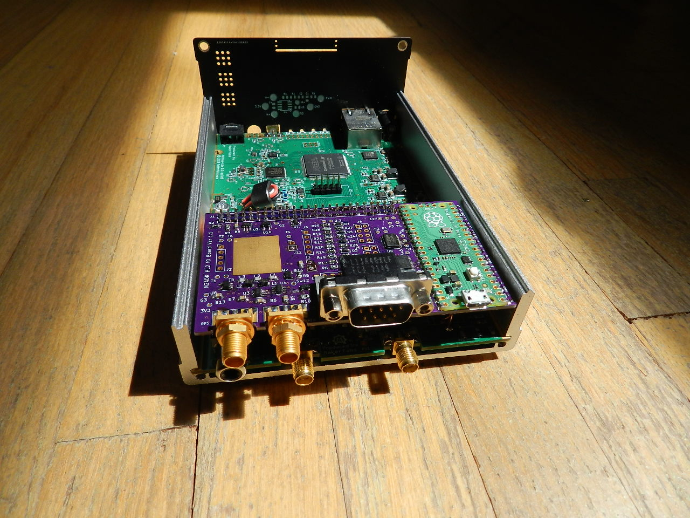
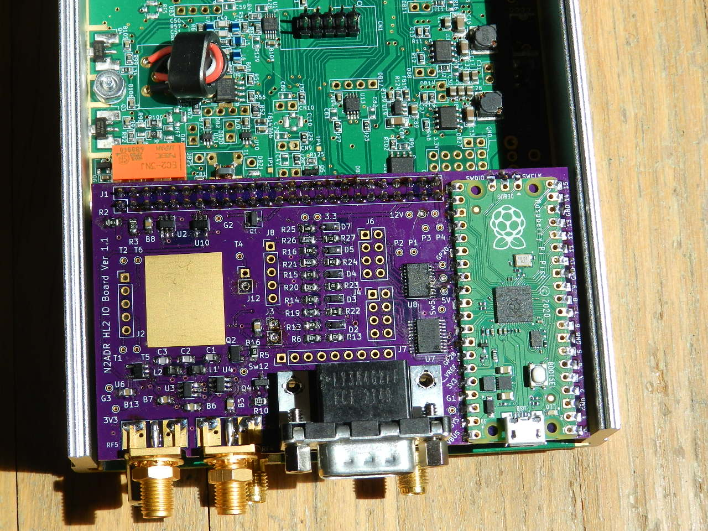
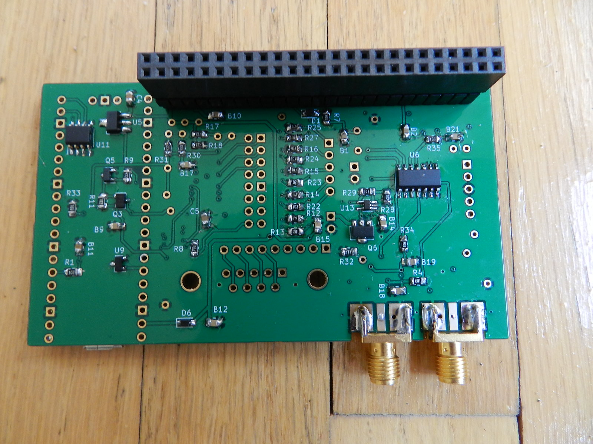
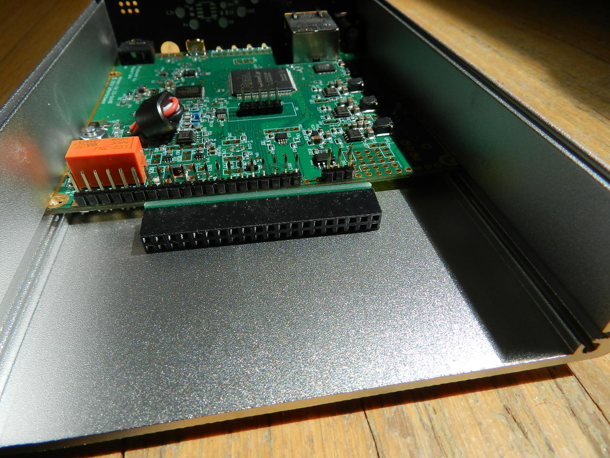

# IO Board for the Hermes Lite 2 by N2ADR
**May 2, 2022**

**This documentation is preliminary, and may change based on input from the HL2 community.**

**Further documentation is coming, stay tuned. Please provide feedback, especially if you see a problem.**

This project is a 5 by 10 cm printed circuit board and related firmware. The board has a Pico microcontroller and IO resources including
5 volt gates, low side switches, a fan controller, and a UART. There are two SMA connectors for a separate Rx input and a Pure Signal input.
The board plugs into the [Hermes Lite 2](http://www.hermeslite.com) main board and replaces the 2x20 jumper that connects to the N2ADR filter board.
The board sits directly above the filter board as shown in the photos below.

The IO board connects to the existing I2C interface in the Hermes Lite 2 (the "HL2").
The [HL2 protocol](https://github.com/softerhardware/Hermes-Lite2/wiki/Protocol)
provides a way to send and receive I2C message from host SDR software running on a PC. These I2C messages can be directed to the IO board to
control its operation. The microcontroller can respond to these messages by switching relays and controlling an attached power amplifier.
The user can modify the microcontroller firmware to control whatever external devices are present.

#### IO board mounted above the filter board

#### Top view of the board

#### Bottom view of the board

## Modification to the HL2 Main Board
The HL2 main board must be modified by adding three extra header pins. In the picture below, look at the normal 20 pin
header at the back edge of the board. Following that, two holes are skipped, and then a 1x3 header is added. This changes the
20 pin header to a 25 pin header with two unused pins. The extra pins provide 3.3 volts, ground and VSUP.
VSUP is the 12 volt HL2 input supply taken after the fuse.
It is convenient to place the 2x20 pin header across the existing pins and the three added pins to provide
alignment when soldering. The IO board has a 2x25 pin header. When installed, this connects the HL2 to the filter board as usual.

## Design of the IO Board Hardware
Please refer to the [schematic](pictures/HL2IOBoard.pdf).
The IO board has two I2C addresses. Address 0x41 register 0 is a read only register that returns the hardware version number
in bits 3 to 0, and 0xF in bits 7 to 4. So for this hardware version, it returns 0xF1. If other IO boards become available,
they will return different version numbers. This is the hardware version and will be returned even if the firmware is not running.
Reading this register can test whether the filter board is installed.

The microcontroller listens to I2C address 0x1D. This is distinct from the filter board I2C address, and the IO board will
not conflict with or control the filter board. The IO board has these resources controlled by the Pico:

 * Eight 5 volt CMOS outputs and eight low-side switches (mosfets to ground). Both are controlled by the same Pico pin,
so they can be used in any combination, but only up to eight total. They are high speed except for output 8. This has an RC filter and is intended for
optional zero to five volt PWM DC output. The DC output can be programmed to change according to the band in use, and is used to
change bands in external amplifiers. If not needed, output 8 can still be an output, but at slow speed.
 * Five logic inputs that are protected, and work from plus 3.3 to 20 volts.
 * A source of switched 12 volt power.
 * A source of switched 5 volt power.
 * A variable DC voltage from zero to about 12 volts. This is intended to drive a fan.
 * A logic input that reads the state of EXTTR from the HL2.
 * Control for a switched high pass filter in the receive input.
 * A mode control to determine how the receive and Pure Signal inputs are used. Mode 0 means that the receive input is not used,
but the Pure Signal input is available. Mode 1 means that the receive input is used instead of the usual HL2 input, and the Pure Signal input is not available.
Mode 2 means the receive input is used during Rx and the Pure Signal input is used during Tx.
 * Pico GPIO 5 is unused.
 * Pico GPIO 26, 27 and 28 are unused. They can be used for 3.3 volt logic or for ADC inputs. The ADC reference is 3.00 volts.
 * Any Pico pins can be used directly at 3.3 volt logic.

These resources can be used for various purposes. The pico has two UARTs. Output 1 and Input 1 can be used for UART Tx and Rx.
A "low-side switch" is a mosfet to ground. They are commonly used to switch relays. But they can also implement a wired-or bus
such as a one-wire bus or an I2C bus. The Icom AH-4 antenna tuner can be controlled this way.

There is a 15x18 mm bare copper area for prototyping. There is a 1x5 and 1x2 header to plug in a perf board for additional area.

The board has a DB9 connector and the pins are wired to a 1x9 pin header. The outputs go to two 2x4 headers, and the inputs go to a 1x5 header.
Other IO goes to small pads. The headers are not installed. Wire everything up as desired with hookup
wire to the pads and to the DB9 pads. Of course, you can add headers if desired.

## IO Board Firmware
The microcontroller listens to I2C address 0x1D and you can read and write to registers at this address.
Reads always return four bytes of data. Writes always send one byte.
The only read register is register 0.
 * A read from register 0 returns the firmware major version, the firmware minor version, the state of the input pins, and 0xFE.
The input pin bits are In5, In4, In3, In2, In1, Exttr. Beware of byte order.

These are the write registers as of May 2, 2022:
 * Register 0 is a temporary buffer for multi-byte data.
 * Register 1 is a temporary buffer for multi-byte data.
 * Register 2 is a temporary buffer for multi-byte data.
 * Register 3 is a temporary buffer for multi-byte data.
 * Register 11 is the receive input mode, 0, 1 or 2.
 * Register 12 is the fan voltage as a number from 0 to 255.
 * Register 13 is the least significant byte of the Tx frequency in Hertz. To send Tx frequency write registers MSB 0, 1, 2, 3, 13 LSB.

## Modifications to SDR PC Software

Since the HL2 can read and write the I2C bus to communicate with the IO board, it would be possible for SDR software
authors (Quisk, Spark, Power SDR, etc.) to write extensive logic to control IO. This is NOT the desired result. Instead
users should write new firmware to provide the services they require. It is easy to write firmware for the Pico.
Ideally, an owner of a given power amp, for example HR50, would write a custom firmware and provide a wiring diagram
for that amp. The only required SDR modification is sending the transmit frequency. The transmit frequency can be read
by HamLib CAT in case an external helper program is used.

*Do NOT ask authors to modify SDR software! Write new firmware instead!*

### Transmit Frequency

SDR software must send the transmit frequency to provide band information to power amps, transverters and loop antennas.
You can wait for the band to change, and then just send a frequency in the band. For example, if the
user presses the 40 meter button, send 7.0 MHz. This is enough to determine the band, but not enough to tune a loop antenna.
You can send the exact Tx frequency, but since the user is probably doing a lot of tuning, it is best to limit the I2C
traffic. Quisk sends the Tx frequency at maximum rate of once every 0.5 seconds, and only if it changes. The frequency
data in registers 0, 1, 2 and 3 are static, and are only used when register 13 is written. So you don't need to re-send them unless
they change. Quisk makes no use of this, and always sends all five registers.

### RF Receive Input

The mode control 0, 1 or 2 is a user setting. There needs to be an option to set this.

### Fan Control

The fan speed control can be an internal calculation based on temperature, as is currently the case for the fan control
in the HL2 gateware. I don't see the need for a user option for this.

**Further documentation is coming, stay tuned. Please provide feedback, especially if you see a problem.**
