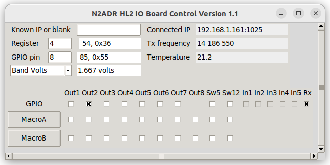
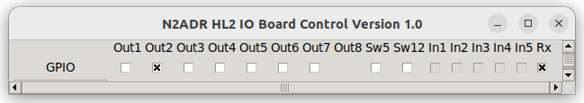

# IO Board for the Hermes Lite 2 by N2ADR
**January 6, 2024**

**Please click the left button "-  ----" above for a navigation menu.**

**Register names are now fixed, but there may be additions. Further documentation is coming, stay tuned.
Please provide feedback, especially if you see a problem.**

This project is a 5 by 10 cm printed circuit board and related firmware. The board mounts in the same box as the Hermes Lite 2.
It mounts above the N2ADR filter board if one is installed.
The filter board and the IO board are independent of each other.
The PC running the SDR software sends the transmit frequency to the board.
The microcontroller on the board then uses the board's switches to control an amplifier, switch antenns or transverters, etc.
There are a variety of IO resources available and there will be different microcontroller software for each application.
The IO board is meant to be a general purpose solution to control hardware attached to the HL2.

The IO board could also be connected to the I2C bus on a single board computer to provide station control.

The board has a Pico microcontroller and IO resources including
5 volt gates, low side switches, a fan controller, and a UART. There are two SMA connectors for a separate Rx input and a Pure Signal input.
The board plugs into the [Hermes Lite 2](http://www.hermeslite.com) main board and replaces the 2x20
jumper that connects to the N2ADR filter board.
The board sits directly above the filter board (if any) as shown in the photos below.

To use the board it will be necessary to choose which switches you need and solder wire jumpers from the switches to the DB9 connector.
Then you must write or download firmware for the Pico that will operate the switches based on the transmit frequency.

#### IO board mounted above the filter board

#### Top view of the board

#### Bottom view of the board

## Modification to the HL2 Main Board
The HL2 main board must be modified by adding three extra header pins. In the picture below, look at the normal 20 pin
header at the back edge of the board. Following that, two holes are skipped, and then a 1x3 header is added. This changes the
20 pin header to a 25 pin header with two unused pins. The extra pins provide 3.3 volts, ground and VSUP.
VSUP is the 12 volt HL2 input supply taken after the fuse.
It is convenient to place the 2x20 pin header across the existing pins and the three added pins to provide
alignment when soldering. The IO board has a 2x25 pin header. When installed, this connects the HL2 to the filter board as usual.

For the three-pin header you need the same size as the 1x20 header on the main HL2 board. The pin pitch is 2.54 mm.
On my HL2, the total height is 11.43 mm with 3.05 mm below the PCB. The pins are square and 0.64 mm on a side.
But my HL2 is an old one, so check what size your pins are. The exact height is not too critical.

#### Added three-pin header

## Initial Testing of the IO Board
Please test the IO board when you get it.
First program the Pico with the test program.
Power off the HL2 and connect a USB cable to the IO Board.
Push the button on the Pico and then plug the USB cable into your PC.
The Pico will appear as a flash drive on the PC. Then copy the file n2adr_test/build/main.uf2 to the Pico. The Pico will reboot and the Pico LED will flash slowly.

Now apply power to the HL2. Use an oscilloscope to see the test signals.
  * Look for pulses of 1,2,3,4,5,6,7 milliseconds on J4 pins 1 to 7.
  * Look for 3.0 volts DC on J4 pin 8.
  * Look for 0.5 * supply voltage at J3 pin 1.
  * Look for a 5.0 volt 500 Hz square wave at Sw5.
  * Look for a supply voltage 250 Hz square wave at Sw12.

Connector J6 has MOSFETs that short the pin to ground.
To test, connect a DC voltage of 3.3 to 16 volts to one end of a resister of a few thousand ohms.
Connect the other end to an oscilloscpe, and use this end to probe J6 pins 1 to 7.
You should see the same signal as on J4 but with reverse polarity.

The test program can generate a test pattern for the antenna tuner protocol. Write a "1" to REG_ANTENNA_TUNER. SDR authors can use this to help write code for this feature. 

## Design of the IO Board Hardware
The IO board is a four-layer PCB. Rather large parts are used, with none smaller than 0805 (2012 metric). It is designed to be easy to solder at home. It is only necessary to mount the parts you plan to use.

Please refer to the [schematic](KiCad/HL2IOBoard.pdf).
The IO board has two I2C addresses. Address 0x41 register 0 is a read only register that returns the hardware version number
in bits 3 to 0, and 0xF in bits 7 to 4. So for this hardware version, it returns 0xF1. If other IO boards become available,
they will return different version numbers. This is the hardware version and will be returned even if the firmware is not running.
Reading this register can test whether the filter board is installed.

The Pico microcontroller listens to I2C address 0x1D. This is distinct from the filter board I2C address, and the IO board will
not conflict with or control the filter board. The IO board has these resources controlled by the Pico:

 * Eight 5 volt CMOS outputs and eight low-side switches (mosfets to ground). Both are controlled by the same Pico pin,
so they can be used in any combination, but only up to eight total. They are high speed except for output 8. This has an RC filter and is intended for
optional zero to five volt PWM DC output. The DC output can be programmed to change according to the band in use, and is used to
change bands in external amplifiers. If not needed, output 8 can still be an output, but at slow speed.
 * Five logic inputs that are protected, and work from plus 3.3 to 20 volts.
 * A source of switched 12 volt power.
 * A source of switched 5 volt power.
 * A variable DC voltage from zero to about 12 volts. This is intended to drive a fan.
 * A logic input that reads the state of EXTTR from the HL2.
 * An SMA receive input.
 * Control for a switched high pass filter in the receive input.
 * An SMA Pure Signal input.
 * Pico GPIO 5 is unused.
 * Pico GPIO 26, 27 and 28 are unused. They can be used for 3.3 volt logic or for ADC inputs. The ADC reference is 3.00 volts.
 * Any Pico pins can be used directly at 3.3 volt logic.

These resources can be used for various purposes. The Pico has two UARTs. Output 1 and Input 1 can be used for UART Tx and Rx.
Note that the signal voltages are zero and five volts. This is common for communication between microcontrollers.
But the standard RS232 levels are more like plus and minus eight volts, so a connection to a PC will require an interface IC.

A "low-side switch" is a mosfet to ground. They are commonly used to switch relays. But they can also implement a wired-or bus
such as a one-wire bus or an I2C bus. The Icom AH-4 antenna tuner can be controlled this way. The switches are implemented
in a TBD62381AFWG,EL integrated circuit. This has an absolute maximum rating of 50 volts and 500 ma per channel.

**These low-side switches are NOT protected against inductive loads. Always place a diode across relay coils and any other inductive load.**

There is a 15x18 mm bare copper area for prototyping. There is a 1x5 header J2 and a 1x2 header J12 to plug in a perf board for additional area.

The board has a DB9 connector and the pins are wired to a 1x9 pin header. The outputs go to two 2x4 headers, and the inputs go to a 1x5 header.
Other IO goes to small pads. The headers are not installed. Wire everything up as desired with hookup
wire to the pads and to the DB9 pads. Of course, you can add headers if desired.

### Table of IO Resources

|Software Pin Name |Usage|Connector Reference|
|------------------|-----|-------------------|
|GPIO00_HPF|Control HPF in Rx path||
|GPIO01_Sw12|Switched VSUP (usually 12 volts)|Sw12|
|GPIO02_RF3|Control Pure Signal input||
|GPIO03_INTTR|Control HL2 T/R relay||
|GPIO04_Fan|Zero to 11.5 fan voltage|J3|
|GPIO05_xxx|not connected||
|GPIO06_In5|Protected logic input|J8 pin 5|
|GPIO07_In4|Protected logic input|J8 pin 4|
|GPIO08_Out8|5V logic ; low side switch|J4 pin 8 ; J6 pin 8|
|GPIO09_Out7|5V logic ; low side switch|J4 pin 7 ; J6 pin 7|
|GPIO10_Out5|5V logic ; low side switch|J4 pin 5 ; J6 pin 5|
|GPIO11_Out4|5V logic ; low side switch|J4 pin 4 ; J6 pin 4|
|GPIO12_Sw5|Switched 5 volts|Sw5|
|GPIO13_EXTTR|Logic input EXTTR, High for Rx, low for Tx||
|GPIO14_I2C1_SDA|HL2 I2C bus||
|GPIO15_I2C1_SCL|HL2 I2C bus||
|GPIO16_Out1|5V logic ; low side switch|J4 pin 1 ; J6 pin 1|
|GPIO17_In1|Protected logic input|J8 pin 1|
|GPIO18_In2|Protected logic input|J8 pin 2|
|GPIO19_Out2|5V logic ; low side switch|J4 pin 2 ; J6 pin 2|
|GPIO20_Out3|5V logic ; low side switch|J4 pin 3 ; J6 pin 3|
|GPIO21_In3|Protected logic input|J8 pin 3|
|GPIO22_Out6|5V logic ; low side switch|J4 pin 6 ; J6 pin 6|
|GPIO25_LED|Pico on-board LED||
|GPIO26_ADC0|not connected||
|GPIO27_ADC1|not connected||
|GPIO28_ADC2|not connected||

## IO Board Pico Firmware
### Installing Firmware
Firmwares for the Pico are in subdirectories of HL2IOBoard. Look in the source files to see what they do.

- n2adr_test   Test program to toggle the 5 volt outputs.
- n2adr_basic  Very basic example.
- n2adr_lib    Library of useful subroutines used in the above.
- n1adj_hr50   Control the [Hardrock-50](https://hobbypcb.com/products/hardrock-50-hf-power-amp-kit) amplifier.

To create your own firmware, install the Pico SDK and create a directory for your code.
You may want to clone my github project to get you started.
Export the location of your SDK: export PICO_SDK_PATH=/home/jim/etc/pico-sdk.
Copy the file pico-sdk/external/pico_sdk_import.cmake to your directory.
Copy my CMakeLists.txt and main.c to your directory and edit them as desired.
Make a "build" subdirectory.
Change directories to the build directory and enter "cmake .." and "make".
See the Pico documentation for more detail.
Be careful with i2c_slave_handler(), as it is an interrupt service routine. Return quickly and do not put printf's here! Just set a flag and look for it in the loop at the end of main().

To install the firmware, power off the HL2 and connect a USB cable to the IO Board.
Push the button on the Pico and then plug the USB cable into your PC.
The Pico will appear as a flash drive on the PC. Then copy the file build/main.uf2 to the Pico. 

There is an LED on the Pico. When the firmware is running, it flashes slowly. When the Pico receives I2C traffic directed to its address, it flashes faster.

### Firmware Design

The Pico listens to I2C address 0x1D and you can read and write to registers at this address. Writes always send one byte.
Reads always return four bytes of data.
A read from a register returns that register and the next three.
All registers are 8 bit and are initialized to zero at power on, and after a software reset.

Since the register address is one byte, there are 256 registers. This is implemented as a 256 byte static array.
You can write to any register, not just the ones in the table below. 
In general, a read from a register returns the last value written, but there are exceptions noted in the table below.
The polling loop in main.c can see all 256 registers and can implement an action for any register.
Registers 200 and up can be claimed by SDR authors, and are used for features that are optional or unique to an SDR program.

#### Frequency Codes

The files n2adr_lib/frequency_code.c and frequency_code.py contain functions to convert a frequency in hertz to a one-byte code,
and to convert a code back to a frequency. The code is a useful one-byte approximation of the frequency
which is sufficient to recognize the band and to select antennas.
The codes are monotonic in frequency. The special code zero means the frequency was not entered and is unspecified.
A table of all the codes is at [frequencycodes.html](http://james.ahlstrom.name/frequencycodes.html).
Run the Python file "python frequency_code.py" to print your own table of codes.

#### Band Codes

A band code is a single frequency code for each band.
The band code is chosen to be as close to the band frequency as possible. All other frequency codes are assigned to the closest band code.
A table of band codes is in hl2ioboard.h.
You can use the band code to select antennas, or you can use the frequency code directly.

The band code is convenient because some bands have multiple frequency codes. And since all frequency codes resolve to the
closest band code, there are no gaps in coverage. If you tune outside the band, the closest band antenna is chosen.

#### Global Variables

These global variables are set in i2c_slave_handler() when data is received:

  * extern uint64_t new_tx_freq;
  * extern uint8_t new_tx_fcode;

The Tx frequency and Tx frequency code are set when the Tx frequency changes.

  * extern bool rx_freq_changed;
  * extern uint8_t rx_freq_high;
  * extern uint8_t rx_freq_low;

These are set when any of the twelve Rx frequencies change. If all Rx frequencies are zero, rx_freq_high and low are both zero.

  * extern uint8_t Registers[256];

This is the array of all register data.

  * extern uint8_t firmware_version_major;
  * extern uint8_t firmware_version_minor;

You must set the version in your main routine so it can be returned to software.

#### Library Functions

The directory n2adr_lib contains utility functions to make writing Pico software easier.

  * void configure_led_flasher(void)

Call this once near the start of your Pico program. It controls flashing the Pico LED.

  * void configure_pins(bool use_uart1, bool use_pwm4a)

This sets the configuration of the Pico GPIO pins, and you must call this once near the start of your program.
If use_uart1, J8 pin 1 and J4 pin 1 are UART pins; otherwise they are regular logic.
If use_pwm4a, J4 pin 8 is used for a variable 0 to 5 volt band voltage; otherwise it is regular logic.

  * uint8_t hertz2fcode(uint64_t hertz)
  * uint64_t fcode2hertz(uint8_t code)

These functions convert between a 5-byte frequency and a 1-byte frequency code. They are in frequencycode.c.
The file frequencycode.py is the same code in Python, and it is not used here. It is included for convenience.

  * uint8_t fcode2band(uint8_t fcode)

This converts a frequency code to a band code. A band code is a single frequency code for each band. See below.

  * void ft817_band_volts(uint8_t band_code)
  * void xiegu_band_volts(uint8_t band_code)

These are used to generate a zero to five volt band voltage on J4 pin 8.

  * i2c_slave_handler.c

This contains the I2C interrupt handler that is called for I2C reads and writes. Since it must return quickly,
it mostly sets registers and global variables that you can test in a loop in your Pico program.
When it receives the Tx frequency, it sets new_tx_freq to the frequency and new_tx_fcode to the corresponding frequency code.
It also uses firmware_version_major and firmware_version_minor, and you must set these in your Pico program.

  * icom_ah4.c

This contains code to control the Icom AH4 antenna tuner. It is untested.

#### Table of I2C Registers

When you write code, please use the register names shown. The names are in i2c_registers.h.

|Register|Name|Description|
|--------|----|-----------|
|0|REG_TX_FREQ_BYTE4|Most significant byte of the 5-byte Tx frequency in Hertz|
|1|REG_TX_FREQ_BYTE3|Next Tx frequency byte|
|2|REG_TX_FREQ_BYTE2|Next Tx frequency byte|
|3|REG_TX_FREQ_BYTE1|Next Tx frequency byte|
|4|REG_TX_FREQ_BYTE0|The least significant byte of the Tx frequency.|

The transmit frequency is a five-byte integer number in hertz. You can send BYTE1 to BYTE4 in any order.
When BYTE0 is sent, the Pico will update the global 64-bit integer new_tx_freq and the 8-bit frequency code new_tx_fcode.
This happens in an interrupt service routine in n2adr_lib/i2c_slave_handler.c.
Use a polling routine in your main.c to look for changes. See the example in n2adr_basic.
If a transverter is in use, the Tx frequency includes the transverter offset.

|Register|Name|Description|
|--------|----|-----------|
|5|REG_CONTROL|Write 1 to reset all the registers to zero.|
|6|REG_INPUT_PINS|Read only. The input pin bits: In5, In4, In3, In2, In1, Exttr|
|7|REG_ANTENNA_TUNER|Control an antenna tuner|

A write to register REG_ANTENNA_TUNER is a command to the tuner. I am modeling this on the Icom AH-4 but I want it to work in general.
See the code in n2adr_lib/icom_ah4.c.
A write of 1 starts a tune request.
A write of 2 is a bypass command. Other tuners may have more commands. The Pico will talk to the ATU and change the register to higher numbers to indicate progress.
The PC must read this register while tuning progresses. If the register reads as 0xEE the PC must send RF to the ATU, and stop RF when 0xEE stops.
A final value of zero indicates a successful tune. Values of 0xF0 and higher indicate that tuning failed.
Note that the IO board can not initiate RF and so the need for 0xEE.
SDR software is not required to implement this command. In the future there may be an external program to do this.

|Register|Name|Description|
|--------|----|-----------|
|8|REG_FAULT|Read only. Zero for no fault. The meaning of non-zero codes is not currently defined.|
|9|REG_FIRMWARE_MAJOR|Read only. Firmware major version|
|10|REG_FIRMWARE_MINOR|Read only. Firmware minor version|
|11|REG_RF_INPUTS|The receive input usage, 0, 1 or 2.|

REG_RF_INPUTS determines how the SMA receive input J9 and the Pure Signal input J10 are used. Mode 0 means that the receive input is not used,
but the Pure Signal input is available. Mode 1 means that the receive input is used instead of the usual HL2 input,
and the Pure Signal input is not available. Mode 2 means that the receive input is used for receive, and the Pure
Signal input is used for transmit.

|Register|Name|Description|
|--------|----|-----------|
|12|REG_FAN_SPEED|The fan voltage as a number from 0 to 255|
|13|REG_FCODE_RX1|The frequency code for the first receiver RX1|
|14-24|REG_FCODE_RX2 to RX12|The frequency code for receiver RX2 to RX12|

The HL2 can have from one to twelve independent receivers. SDR software can use this feature
to scan multiple bands for digital or CW signals. Choosing an antenna requires knowing all the Rx frequencies.
The Rx frequencies are sent as a one-byte frequency code to registers 13 to 24 with names REG_FCODE_RX1 to RX12.
The HL2 always has RX1, but if it is unspecified (zero) it is the same as the Tx frequency.
If any Rx frequency is changed, the global boolean rx_freq_changed is set to true.
If a transverter is in use, the Rx frequency includes the transverter offset.

|Register|Name|Description|
|--------|----|-----------|
|25|REG_ADC0_MSB|The most significant byte of ADC0|
|26|REG_ADC0_LSB|The least significant byte of ADC0|
|27|REG_ADC1_MSB|The most significant byte of ADC1|
|28|REG_ADC1_LSB|The least significant byte of ADC1|
|29|REG_ADC2_MSB|The most significant byte of ADC2|
|30|REG_ADC2_LSB|The least significant byte of ADC2|

The Pico has one 12-bit ADC that can read from ADC0, ADC1 and ADC2 on pins GPIO26, GPIO27 and GPIO28.
Always read the most significant byte first because that triggers the conversion.
A read from ADC0 returns the value of ADC0 and ADC1 in the four byte response.
A read from ADC1 returns the value of ADC1 and ADC2.
Reading the two values in quick succession can be used to calculate SWR from forward and reverse power.

|Register|Name|Description|
|--------|----|-----------|
|31|REG_ANTENNA|Choose among multiple antennas|

Normally, the antenna choice is calculated by the Pico based on the Tx and Rx frequencies.
But there may be multiple antennas available for a single band.
The high four bits of REG_ANTENNA is the Tx antenna, and the low four bits is the Rx antenna for the current band.
A zero means the first (default) antenna.

|Register|Name|Description|
|--------|----|-----------|
|32|REG_OP_MODE|Set the operating Mode|

||Mode|Value|Mode|Value|Mode|Value|Mode|Value|
|---|---|---|---|---|---|---|---|---|
||LSB|0|USB|1|DSB|2|CWL|3|
||CWU|4|FM|5|AM|6|DIGU|7|
||SPEC|8|DIGL|9|SAM|10|DRM|11|
||AM_LSB|12|AM_USB|13|

Operating mode values are based on Thetis internal definitions.
Note that value zero does not mean "unspecified".

|Register|Name|Description|
|--------|----|-----------|
|167|REG_STATUS|Read or write to Sw5 and Sw12. Read the In1 configuration.|
|168|REG_IN_PINS|Same as REG_INPUT_PINS plus Out1 and Out8 configuration.|
|169|REG_OUT_PINS|Read or write to GPIO Out8 to Out1 directly.|
|170|GPIO_DIRECT_BASE|Map this register to GPIO 0|
|171-198||GPIO 1 to 28|

A read or write to registers GPIO_DIRECT_BASE to GPIO_DIRECT_BASE + 28 reads or writes to the Pico GPIO pins 0 to 28.
This supports using Steve's hermeslite.py or similar to control the Pico registers directly.
A user could write a program to switch antennas without adding C code to the Pico.
Since the SDR program writes Tx and Rx frequencies to the Pico, a third party program could read them back to select the antenna.
For C programmers, it would still be easier to write the code into the Pico.

The other registers add further support. Bits are numbered from 7 to zero and the most significant bit is 7.

  * REG_STATUS

Bit 0 is Sw5, bit 1 is Sw12, bit 2 is 1 if In1 is configured as a UART.

  * REG_IN_PINS

This is read-only. It is the same as REG_INPUT_PINS, and adds two bits. Bit 6 is 1 if Out1 is configured as UART.
Bit 7 is 1 if Out8 is configured as band volts.

  * REG_OUT_PINS

This reads and writes Out1 to Out8 directly. Bit 0 is Out1 and bit 7 is Out8.

|Register|Name|Description|
|--------|----|-----------|
|200-255||Reserved for SDR authors. If you use them, please document them.|

## Modifications to SDR PC Software

The IO board connects to the I2C interface in the Hermes Lite 2.
The [HL2 protocol](https://github.com/softerhardware/Hermes-Lite2/wiki/Protocol)
provides a way to send and receive I2C messages from host SDR software to the IO board to control its operation.
Quisk uses the ACK bit with I2C commands. As described in the protocol, these commands should
be sent at intervals so they don't disrupt normal protocol commands.

Since the PC can read and write the I2C bus to communicate with the IO board, it would be possible for SDR software
authors (Quisk, Spark, Power SDR, etc.) to write extensive logic to control IO. This is NOT the desired result. Instead
users should write new Pico firmware to provide the services they require. It is easy to write firmware for the Pico.
Ideally, an owner of a given power amp, for example HR50, would write a custom firmware and provide a wiring diagram for that amp.

**Do NOT ask authors to modify SDR software! Write new firmware instead!**

### Reset

The IO board registers are static and may have old data.
When your SDR program starts, write 1 to REG_CONTROL to set all registers back to zero.

### Transmit Frequency

The only required SDR modification is sending the transmit frequency.
SDR software must send the transmit frequency to provide band information to power amps, transverters and loop antennas.
You can wait for the band to change, and then just send a frequency in the band. For example, if the
user presses the 40 meter button, send 7.0 MHz. This is enough to determine the band, but not enough to tune a loop antenna.
You can send the exact Tx frequency, but since the user is probably doing a lot of tuning, it is best to limit the I2C
traffic. Quisk sends the Tx frequency at a maximum rate of once every 0.5 seconds, and only if it changes. The frequency
data in registers BYTE1 to BYTE4 are static, and are only used when register BYTE0 is written. So you don't need to re-send them unless
they change.

### Receive Frequencies

You may need to send the twelve receive frequencies if your SDR software supports multiple receivers.
The Pico will use this to select a receive antenna, probably by finding the highest frequency and
setting low pass filters to that band. If all Rx frequencies are zero, the Rx band is the same as Tx.

### RF Receive Input

The mode control REG_RF_INPUTS is 0, 1 or 2, and is a user setting. There needs to be an option to set this.

### Fan Control

The fan speed control can be an internal calculation based on temperature, as is currently the case for the fan control
in the HL2 gateware. I don't see the need for a user option for this. Quisk does not implement the fan.

## IO Board Control Software

The software directory contains the Python program n2adr_ioboard.pyw which can be used to control the IO board.
It uses Steve's hermeslite.py software, and a copy is included. To use it, copy the two files to a convenient directory.
You will need to install the netifaces package as follows:

python -m pip install netifaces

Then run the program:

python n2adr_ioboard.pyw

#### Control Program

#### Reduced to a Tool Bar

The program will report the IO board status. You can change the status from the program, and this
may reduce the need to modify SDR programs. It provides a way to control the IO board from Python
rather that write code for the Pico.

Normally the program will search for the HL2. If you need to select one of several HL2's or if searching doesn't work,
enter the IP address and press Enter.

Some fields just report status. Click on the fan voltage or band voltage to change the values.
Click on the GPIO boxes to change the values.
The Macro buttons copy their values to the GPIO row all at once.

The N2ADR control program is not "finished" (does any program ever get finished?) and I invite
a discussion about what it should do.

**End of Documentation**
