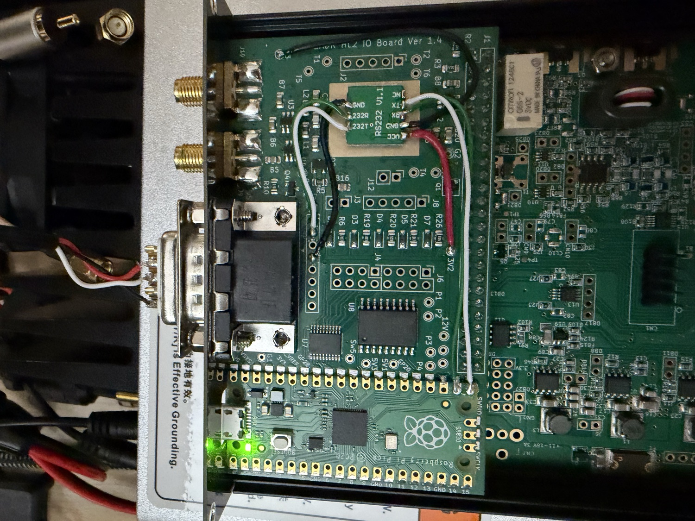
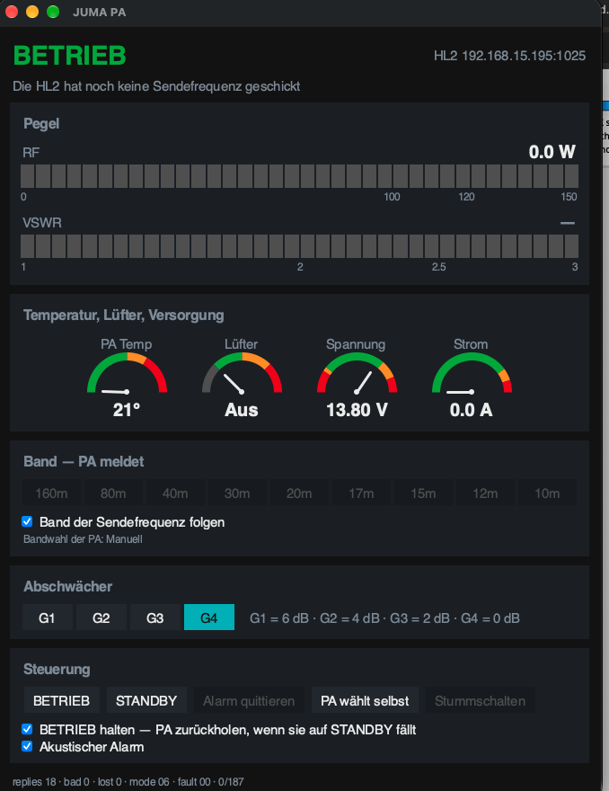
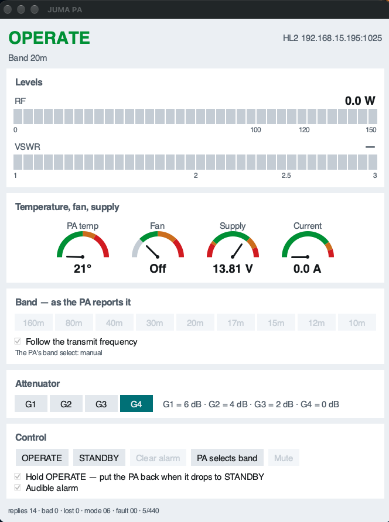

# JUMA firmware for the Hermes Lite 2 IO board

Band switching and status readback for a **JUMA PA-100D** (and its RS-928
clone) from a [Hermes Lite 2](http://www.hermeslite.com) through N2ADR's
[IO board](https://github.com/jimahlstrom/HL2IOBoard). The SDR software sends
the transmit frequency to the board over I2C, the Pico turns it into a `=Bn`
band command on the serial port, and the PA's status comes back into I2C
registers the host can read.

This is the same path M0HPF's `m0hpf_spe` firmware takes for an SPE Expert —
Pico UART, a MAX3232 for RS-232 levels, the amplifier's own command set. Only
the commands differ. The parser and the band table are the ones the ESP32
firmware in this repository uses, not a copy, so a corrected band edge is
corrected in both.

> **No warranty.** This switches the band filters of an amplifier, and the
> wrong filter can destroy the output stage. Before the first serious use,
> check the wiring with the PA's built-in RS-232 loopback test and rehearse the
> band switching in STANDBY.

## What you need

| For | |
|---|---|
| Building the firmware | the Pico SDK, ARM's own toolchain (**not** Homebrew's `arm-none-eabi-gcc`, it ships without newlib), and a built `n2adr_lib` from the HL2IOBoard project |
| The hardware | an IO board with a Pico, a **MAX3232** level shifter, and three wires to the amplifier |
| The window | Python 3.8 or newer with **Tk 8.6 or newer**, and `pyserial` only for the USB route |
| Packaging the window | `pyinstaller`, and `pillow` if you want to redraw the icon |

**Tk 8.6 is not a formality.** Apple still ships Tk 8.5 with `/usr/bin/python3`,
and on current macOS it lays this window out correctly and then paints neither
the labels nor the meters — you get a window with three checkboxes in it and
nothing else. `juma_gui.py` checks the version and says so; the packaged
application carries its own Tk and cannot run into it at all.

On Debian and Ubuntu, `python3-tk`. On Fedora, `python3-tkinter`. On macOS,
either a Homebrew `python3` with `python-tk`, or the packaged application.

## What the JUMA needs that the SPE does not

Three properties of the JUMA protocol shape the firmware:

- **It only speaks when asked.** The SPE polls the transceiver; the JUMA
  answers `=R` and is silent otherwise. The Pico is the master here and polls.
- **Remote mode times out.** 5 s after the last command the PA leaves remote
  mode and falls back to STANDBY. The 500 ms `=R` poll is what keeps it alive —
  it is not there for the display.
- **`=Bn` is a *manual* band selection.** It moves the PA from A to M, and a
  band change can knock it out of OPERATE.

Because of the last point the firmware leaves OPERATE alone by default: it
follows the band and touches nothing else. If you want it held in OPERATE, ask
for it — see `JUMA_MODE_HOLD_OPERATE` below.

## Hardware

An IO board, a Pico, and a **MAX3232** level shifter — the PA has true RS-232
levels, and TTL on its input destroys it. The small blue "HW-027" board M0HPF
uses is one option; any MAX3232 breakout works.

**MAX232 is the wrong part**: 5 V only, and its receiver output swings to 5 V.

The plan below puts a **standard RS-232 DTE pinout on the board's own Sub-D
connector**, so a plain Sub-D-to-jack cable goes straight from the board to the
amplifier and nothing is wired inside the box.

### The whole signal chain

```
                      TTL side                      RS-232 side       cable
                      ────────                      ───────────       ─────

 TX   Pico GP16 ──┬─► 74HCT541 ─► J4.1 ══► T1IN            (MAX3232)
                  └──────────────────────► T1IN    T1OUT ══► J7.3 = Sub-D 3 ──► tip
 RX   Pico GP17 ◄─┬── 1K ◄─ divider ◄─ J8.1 ◄══ R1OUT
                  └◄─────────────────────────── R1OUT    R1IN  ◄══ J7.2 = Sub-D 2 ◄── ring

      5 V module:  5V1 pad ═══════════════════► VCC
      3.3 V module: Pico pin 36 or 3V1 pad ═══► VCC
      both:        G1/G2/G3 pad ═════════════► GND   ═══► J7.5 = Sub-D 5 ─── sleeve
```

For each direction take **one** of the two lines: through the board (a 5 V
module) or straight to the Pico pin (a 3.3 V module). Left of the MAX3232
everything is TTL, right of it true RS-232, and the Sub-D ends up with the
pinout of a normal serial port — so the cable to the amplifier is an ordinary
one with nothing clever in it.

### Board side, either way

`configure_pins(true, false)` is what turns J4 pin 1 and J8 pin 1 into the UART,
so those two are not available as a switch output and a logic input — whether or
not you use them for the shifter.

The firmware switches **Sw5** on at start-up, so a 5 V shifter fed from Sw5
comes up with the board rather than looking like a dead amplifier. Wired to 5V1
or to 3.3 V this changes nothing.

Ground: `G1`, `G2` and `G3` are the pads meant for it. M0HPF's instructions use
J12 pin 2, which is ground as well.

### Two ways to wire the TTL side

The board's TTL side is 5 V: J4 pin 1 is the Pico's TX through a 74HCT541
buffer, and J8 pin 1 is a protected input — a divider straight out of the
schematic:

```
J8 pin 1 ──┬── 330K ──┬── 1K ── GPIO17
           │          └── Schottky to +3V3 (clamp)
          470K
           │
          GND
```

The Pico therefore sees `Vin × 470/(330+470) = Vin × 0.59`. Which of the two
routes below you take depends on what your MAX3232 module wants.

#### A 5 V module: J4 pin 1 and J8 pin 1

The straightforward route, the one `m0hpf_spe` uses. A 5 V receiver output
arrives at the Pico as **2.9 V** — a clean logic high — and the buffered output
gives the module the 5 V TTL it expects.

| MAX3232 | IO board |
|---|---|
| `T1IN` — TTL input (`TX`, `TXD`, `<-`) | **J4 pin 1** |
| `R1OUT` — TTL output (`RX`, `RXD`, `->`) | **J8 pin 1** |
| **+** | **5V1** or **5V3** |
| **−** | **G1**, **G2** or **G3** |

One thing to keep an eye on at 115200: the divider's source impedance is
330K∥470K ≈ 194 kΩ, and with the clamp diode and stray capacitance (~15 pF)
that is a time constant of roughly 3 µs against a bit time of 8.7 µs. It works,
but without much to spare — and it explains why the SPE and Hardrock firmwares
never meet this: at 19200 a bit lasts 52 µs. `REG_JUMA_BADLINES` measures it.
If it climbs steadily, replace **R25 (470K)** and **R26 (330K)** with the same
ratio two decades lower, 4.7K and 3.3K: same division, same protection, time
constant down to about 30 ns.

#### A 3.3 V module: straight to the Pico's pins

Going round the board's own input and output needs a reason, so here it is,
twice over. Both come out of the schematic, not out of preference.

**The level does not survive the divider.** In1 divides by 330K/(330K+470K) =
0.59. A 5 V receiver output arrives as 2.9 V, a clean high — but a 3.3 V one
arrives as **1.9 V**, below the RP2040's specified input high threshold. The
Schmitt trigger may well take it; it is not designed to.

**And at 115200 the divider is tight even when the level is right.** Its source
impedance is 330K∥470K ≈ 194 kΩ, and with the clamp diode and stray capacitance
(~15 pF) that is a time constant of roughly 3 µs against a bit time of 8.7 µs.
That is why the SPE and Hardrock firmwares in this project never meet it: at
19200 a bit lasts 52 µs and 3 µs is nothing. At 115200 it is a quarter of the
eye.

Wired straight to the pin, both problems go at once. The full 3.3 V swing
arrives, and the divider network — still hanging off GP17 through R27, 1 kΩ —
now charges its 15 pF through that 1 kΩ instead of 194 kΩ: about 15 ns. The
parasitic load is 3.3 V across roughly 470 kΩ, some 7 µA.

The Pico is mounted with through-hole pads for every pin (`RPi_Pico_SMD_TH`), so
this is a wire, not a rework. Nothing on the board is modified and the firmware
does not change — it is still UART0 on GPIO16/17. A 5 V module has neither
problem and should use J4 pin 1 and J8 pin 1 as every other firmware here does.



Built that way it looks like this: the shifter sits on the free copper in the
middle, red from its `VCC` to the **3V2** pad, the three RS-232 wires off to the
Sub-D on the left, and the two TTL wires down to the Pico's own pins. Nothing is
soldered to J4 or J8 at all.

| MAX3232 | Pico pin | |
|---|---|---|
| `T1IN` — TTL input (`TX`, `TXD`, `<-`) | **21** (GP16) | 3.3 V, ahead of the 74HCT541 |
| `R1OUT` — TTL output (`RX`, `RXD`, `->`) | **22** (GP17) | 3.3 V, past the divider |
| **+** | **36** (3V3 OUT) | or the board's **3V1** / **3V2** pad |
| **−** | GND | **G1** / **G2** / **G3**, or Pico pin 38 |

GP16 is safe to tap: its only other nodes are `U7.8` and `U8.7`, and both are
*inputs* of driver ICs — the 74HCT541 that feeds J4 pin 1 and the TBD62381 low
side switch that feeds J6 pin 1. They never drive back, so one Pico output ends
up driving three inputs. GP17 has exactly one other node, `R27`, the 1 kΩ into
the protection network.

That does have a consequence. The 541's two output enables are hard-wired to
ground, so it is never off, and the TBD62381 input is driven unconditionally:

- **J4 pin 1** carries the transmit data as 5 V logic, and **J6 pin 1**
  switches its MOSFET with every serial bit. Unconnected both are harmless — but
  a relay on J6 pin 1 would chatter at 115200.
- **J8 pin 1** must stay unconnected too: anything driven into it would fight
  the module for GP17.

### Sub-D pinout on the board

Wire the three RS-232 signals to **J7**, the 1x9 header, whose pins go 1:1 to
the Sub-D **J5**. So J7 pin *n* is Sub-D pin *n*.

| Sub-D / J7 pin | Signal | Direction | From |
|---|---|---|---|
| **3** | TxD | board → PA | `T1OUT`, the driver output (`RS232T`, `<-`) |
| **2** | RxD | PA → board | `R1IN`, the receiver input (`RS232R`, `->`) |
| **5** | GND | — | G1 / G2 / G3 |

That is the normal DTE assignment, the same as a PC serial port. **The board's
Sub-D is male** (`DSUB-9_Male_Horizontal` in the schematic), so the cable needs a
**female** Sub-D.

> This deliberately differs from `m0hpf_spe`, which puts the output on pin 2 and
> the input on pin 3. That suits the cable the SPE expects; here the point is a
> connector that behaves the way every RS-232 port does, so the cable is an
> ordinary one.

### The cable

Sub-D 9 female → 3.5 mm stereo jack plug, three wires:

| Sub-D | | JUMA **PA-100D** | **RS-928** |
|---|---|---|---|
| pin 3 | TxD, into the PA | **tip** | **ring** |
| pin 2 | RxD, out of the PA | **ring** | **tip** |
| pin 5 | GND | **sleeve** | **sleeve** |

**The RS-928 has tip and ring the other way round** — that is the one wiring
trap on the clone. Sleeve stays ground on both.

Screened cable, screen on pin 5. Keep it short and away from the coax: this runs
beside a transmitter.

### Which pin on the module is which?

Breakout boards label these differently, and one of the labels is not
trustworthy. On the RS-232 side it is unambiguous: `RS232T` is the driver output
`T1OUT`, `RS232R` the receiver input `R1IN`. On the TTL side a pin marked `TX`
is usually the driver *input* — named from the point of view of the
microcontroller you attach, so it goes to the Pico's TX. Some boards name it
from their own point of view instead, and then it is the other way round.

Getting that wrong puts the Pico's GP16 output against the module's `R1OUT`
output. Two measurements settle it without risk:

1. **Module unpowered**, ohmmeter from each RS-232 pin to GND. The MAX3232's
   receiver input has about 5 kΩ to ground internally, so the pin reading
   **3–7 kΩ** is `R1IN` (`RS232R`). The high-impedance one is `T1OUT`
   (`RS232T`).
2. **Module on 3.3 V, nothing else attached.** Tie the TTL pin you believe is
   the input to GND and measure `T1OUT` against ground: about **+5.5 V**. Tie it
   to 3.3 V instead: about **−5.5 V**, because the driver inverts. If it does
   that, it is the driver input and belongs on GP16.

For the first try a **1 kΩ in series** in the GP16 line costs nothing at 115200
into a high-impedance input, and limits a wrong guess to a few milliamps.

### The whole thing as one table

Seven wires on the board, three in the cable. `→` is the direction the data
travels.

**TTL side** — pick one column for your module.

| MAX3232 module | 3.3 V module | 5 V module |
|---|---|---|
| `T1IN` — TTL **input** (`TX`, `TXD`, `TTL-IN`, `<-`) | **Pico pin 21** (GP16) | **J4 pin 1** |
| `R1OUT` — TTL **output** (`RX`, `RXD`, `TTL-OUT`, `->`) | **Pico pin 22** (GP17) | **J8 pin 1** |
| **+** | **3V2** pad (or Pico pin 36) | **5V1** pad (or 5V3) |
| **−** | **G1** / **G2** / **G3** pad | **G1** / **G2** / **G3** pad |

**RS-232 side** — the same either way. J7 is the 1x9 header; its pin *n* is
Sub-D pin *n* on J5.

| MAX3232 module | Board | Sub-D pin | Signal |
|---|---|---|---|
| `T1OUT` — RS-232 **output** (`RS232T`, `<-`) | **J7 pin 3** | 3 | TxD, board → PA |
| `R1IN` — RS-232 **input** (`RS232R`, `->`) | **J7 pin 2** | 2 | RxD, PA → board |
| **−** | **J7 pin 5** | 5 | GND |

**Cable** — Sub-D 9 **female** (the board's is male) to a 3.5 mm stereo plug.

| Sub-D pin | | PA-100D | RS-928 |
|---|---|---|---|
| 3 | TxD, into the PA | **tip** | **ring** |
| 2 | RxD, out of the PA | **ring** | **tip** |
| 5 | GND | **sleeve** | **sleeve** |

**Leave unconnected**

| | Why |
|---|---|
| **J4 pin 1**, **J6 pin 1** | on a 3.3 V module these still carry the transmit data — 5 V logic and a MOSFET switching at 115200 |
| **J8 pin 1** | on a 3.3 V module it would fight the module for GP17 |
| **Sw5** | the firmware switches it on; only of interest if a 5 V module is fed from there |

**Not part of this** — PTT. The PA is keyed from the HL2 to its own PTT jack,
or through a low-side switch on J6 that the host drives via `REG_OUT_PINS`. See
below.

### Before the first transmission

1. Amplifier in **STANDBY**, no RF.
2. Run the PA's built-in **RS-232 loopback test** (its own menu) with the cable
   plugged in. That checks the cable and the shifter without the Pico having to
   be right.
3. Flash a `JUMA_DEBUG` image (see below) and watch the USB port. A status line
   every 500 ms means the whole chain works. Rubbish instead of readable lines is
   a baud rate or a swapped tip/ring.
4. Read `REG_JUMA_LINK` and `REG_JUMA_BADLINES`. Link 1 and bad lines that stay
   put is what a healthy link looks like.
5. Only then rehearse the band switching, still in STANDBY, and check that the
   band on the PA's display follows the SDR.

### If bad lines keep climbing

`REG_JUMA_BADLINES` is the number to watch, and a steadily climbing one on a
5 V module points at the input divider — see above for the two resistors that
fix it. On a 3.3 V module wired straight to the Pico's pins the divider is out
of the path, so look elsewhere: a swapped tip and ring, a missing ground, or the
cable running alongside the coax.

The JUMA's baud rate is not adjustable, so 115200 is not negotiable either.

### PTT

This firmware does serial control only. The PA is still keyed the normal way —
from the HL2 to the PA's own PTT jack, or through one of the board's low-side
switches on J6 driven by the host via `REG_OUT_PINS`. Nothing here asserts PTT,
and nothing here needs to: the band is set between transmissions.

## Building and installing

### Toolchain

**Do not use Homebrew's `arm-none-eabi-gcc`.** That formula is a freestanding
compiler with no newlib — it has no `libc.a`, and the SDK's very first link
fails with `cannot find -lc`. Take ARM's own build instead:

```sh
cd ~
curl -fLO https://developer.arm.com/-/media/Files/downloads/gnu/14.2.rel1/binrel/arm-gnu-toolchain-14.2.rel1-darwin-arm64-arm-none-eabi.tar.xz
tar xf arm-gnu-toolchain-14.2.rel1-darwin-arm64-arm-none-eabi.tar.xz
ln -s ~/arm-gnu-toolchain-14.2.rel1-darwin-arm64-arm-none-eabi ~/arm-none-eabi
```

The Homebrew cask `gcc-arm-embedded` is the same toolchain, but it installs a
`.pkg` and wants an administrator password. The tarball does not.

### SDK and board library

```sh
git clone -b master --depth 1 https://github.com/raspberrypi/pico-sdk.git ~/pico-sdk
cd ~/pico-sdk && git submodule update --init --depth 1 lib/tinyusb   # for USB stdio

export PICO_SDK_PATH=~/pico-sdk
export PICO_TOOLCHAIN_PATH=~/arm-none-eabi

git clone --depth 1 https://github.com/jimahlstrom/HL2IOBoard        # next to this repo
cd HL2IOBoard/n2adr_lib && mkdir -p build && cd build && cmake .. && make
```

### This firmware

```sh
cd .../esp32-juma/hl2io/juma_pa
mkdir -p build && cd build
cmake ..            # add -DHL2IOBOARD=/path/to/HL2IOBoard if it is not the sibling
make
```

The first run fetches `picotool`, which the SDK builds for itself — that is
normal and takes a minute.

Then power off the HL2, hold the button on the Pico while plugging in USB, and
copy `build/main.uf2` to the drive that appears.

Built here with SDK 2.3.1 and the toolchain above: no warnings, 63.8 kB of
flash and 5.8 kB of RAM.

### Which image to build

Every mode bit can be written at runtime, over I2C or over the USB console, so
the only thing that really needs its own image is the trace. The options below
just decide what a board comes up with, which is what matters when nothing on
the host knows the registers.

| Build | For |
|---|---|
| `cmake ..` | out of the box: follows the band, holds the PA in OPERATE, and says once a second on USB what it and the amplifier are doing |
| `… -DJUMA_HOLD_OPERATE=OFF` | leave a STANDBY standing — for a board that is only meant to watch and follow |
| `… -DJUMA_PROXY=ON -DJUMA_TELEMETRY=OFF` | the USB port is the PA's serial port from power-up, for software that already speaks JUMA |
| `… -DJUMA_DEBUG=ON` as well | the bench: every line, every command, every state change |

| Option | Default | |
|---|---|---|
| `JUMA_TELEMETRY` | **ON** | one status line per second on USB. On by default because it answers "is this thing running" with a terminal and nothing else, which is the first question anybody has — and because `juma_gui.py` reads that line over USB |
| `JUMA_HOLD_OPERATE` | **ON** | put the PA back into OPERATE when it drops to STANDBY — three tries, 5 s apart, never while an alarm is latched, and the counter is reset by every band command, because a band change knocking it out is expected |
| `JUMA_PROXY` | OFF | the USB port carries the PA's serial traffic verbatim. It suppresses the telemetry line, and everything typed at the port reaches the amplifier, so it is something to ask for rather than to be given |
| `JUMA_DEBUG` | OFF | the trace, and leave it off together with `JUMA_PROXY` — a trace line is something the PA would never say |

The same defaults are restored when the host resets the board (a write of 1 to
`REG_CONTROL`), along with the firmware's own retry counters and the frequency it
was following — after such a reset no band command goes out until a new frequency
arrives.

### The USB console

Type into it with any terminal; USB CDC ignores the baud rate.

```sh
pio device monitor -p /dev/cu.usbmodem*        # or: screen /dev/cu.usbmodem* 115200
```

| What you type | |
|---|---|
| `=R`, `=O`, `=C`, `=G2`, … | goes to the PA. `=Bn` only with band following off; `=A` switches following off as it goes |
| `mode=0E` | set `REG_JUMA_MODE` |
| `mode+04` / `mode-08` | set or clear those bits, leaving the rest of the byte alone |
| `bootsel` | reboot into the bootloader. The button needs a RESET to be sampled, and plugging in USB does not reset a Pico already powered from the radio — so with the HL2 switched on the button does nothing and this is the way in |
| `reg=51:02` | write any register — `REG_JUMA_SET_GAIN` = 2 here |

`mode+` and `mode-` are what a program uses: switching the telemetry feed on
should not force it to decide, blindly, what happens to the OPERATE hold.

Anything longer than the PA's own commands is refused rather than truncated —
half of a mistyped command is worse than none of it.

With no terminal attached, printing costs nothing: the SDK discards the output as
soon as it sees the port is not open. A terminal that is attached and then stops
reading does cost something, so these builds lower
`PICO_STDIO_USB_STDOUT_TIMEOUT_US` from 500 ms to **10 ms** — a stalled reader
loses output rather than costing the PA its remote mode.

## What it does

- **Follows the transmit frequency.** `new_tx_freq` from the I2C handler goes
  through the shared band table, and `=Bn` goes out once the frequency has held
  still for 150 ms. No band command is ever sent while either the HL2 (EXTTR)
  or the PA (status field 3) says transmit.
- **Stays off bands the PA has no filter for.** 6 m, 60 m, out-of-band: no
  command goes out at all, and the PA keeps the band it had. Same when the HL2
  has not sent a frequency yet — it is not given a guessed default.
- **Keeps the PA on M while it is doing the selecting.** If the PA reports A it
  gets a `=Bn` for the band it is already on, which moves it to M and changes
  nothing else. Three attempts, then it gives up and says so, so a choice made
  at the front panel is not overridden for ever.
- **Polls every 500 ms** and publishes the 13 status fields into I2C registers.
- **Keeps the band it last set** when the host stops sending. There is no
  "connection lost" on this bus — a write to `REG_CONTROL` clears the frequency,
  and the PA is then left where it is rather than moved somewhere. Write
  `JUMA_CMD_AUTO_BAND` to hand band selection back to the PA.
- **Leaves OPERATE alone**, unless asked to hold it. Even then it will not
  argue with an alarm — a protective shutdown stays shut down until somebody
  clears it deliberately.

## I2C registers

The board's own registers are unchanged (see the
[HL2IOBoard README](https://github.com/jimahlstrom/HL2IOBoard#table-of-i2c-registers)).
This firmware adds a block at 0x40, clear of the upstream range, and defines
`REG_FAULT`. Names are in `juma_regs.h`. A read returns four bytes from the
address given, so related values sit next to each other.

| Reg | Name | |
|---|---|---|
| 0x40 | `REG_JUMA_MODE` | rw — standing behaviour, see below |
| 0x41 | `REG_JUMA_CMD` | rw — one-shot command, cleared once sent |
| 0x42 | `REG_JUMA_LINK` | 1 = the values below are fresh |
| 0x43 | `REG_JUMA_FLAGS` | state bits, see below |
| 0x44 | `REG_JUMA_BAND` | band the PA reports, 1 (160 m) … 9 (10 m), 10 = unknown |
| 0x45 | `REG_JUMA_WANT_BAND` | band this firmware wants, 0 = none or not covered |
| 0x46 | `REG_JUMA_GAIN` | attenuator 1…4 (G1 = 6 dB … G4 = 0 dB) |
| 0x47 | `REG_JUMA_ALARMS` | alarm bits as the PA reports them |
| 0x48 | `REG_JUMA_SWR` | VSWR × 10 — 14 is 1.4 |
| 0x49 | `REG_JUMA_VOLTS` | supply volts × 10 |
| 0x4A | `REG_JUMA_AMPS` | current, amps × 10 |
| 0x4B | `REG_JUMA_TEMP` | temperature, two's complement, scale per `FLAGS` bit 3 |
| 0x4C | `REG_JUMA_WATTS_MSB` | output power in watts, 16 bit |
| 0x4D | `REG_JUMA_WATTS_LSB` | |
| 0x4E | `REG_JUMA_FAN` | 0 off, 1 slow, 2 medium, 3 fast |
| 0x4F | `REG_JUMA_REPLIES` | status replies, low byte — counts up while the link lives |
| 0x50 | `REG_JUMA_BADLINES` | lines that were no status reply, low byte |
| 0x51 | `REG_JUMA_SET_GAIN` | rw — write 1…4 for `=Gn`, cleared once sent |
| 0x52 | `REG_JUMA_SET_BAND` | rw — write 1…9 for `=Bn`, cleared once sent; only while `NO_BAND` is set |
| 0x53 | `REG_JUMA_LOST` | bytes dropped by a full receive buffer, low byte |
| 0x54–0x55 | `REG_JUMA_VOLTS100_*` | supply volts × 100, 16 bit — for a display that wants 13.66 V, not 13.6 |
| 0x56–0x57 | `REG_JUMA_AMPS100_*` | current × 100, 16 bit |
| 0x58–0x59 | `REG_JUMA_WATTS10_*` | output power × 10, 16 bit |
| 0x5A–0x5B | `REG_JUMA_SWR100_*` | VSWR × 100, 16 bit |
| 0x5C | `REG_JUMA_BANNER_IDX` | rw — which character of the PA's power-up banner to look at; 0 asks for its length |
| 0x5D | `REG_JUMA_BANNER_CH` | that character, or the length at index 0 |
| 0x5F | `REG_JUMA_SNAP` | wo — write anything to take a snapshot, see below |
| 0x60–0x7B | snapshot | seven stamped groups of four, see below |

`REG_JUMA_MODE`, all bits clear at power-on and that is the intended normal
case:

| Bit | |
|---|---|
| 0 `JUMA_MODE_NO_BAND` | do **not** send `=Bn` on a frequency change |
| 1 `JUMA_MODE_HOLD_OPERATE` | put the PA back into OPERATE when it drops to STANDBY — three attempts, 5 s apart, never while an alarm is latched |
| 2 `JUMA_MODE_TELEMETRY` | one status line per second on the USB port, see below |
| 3 `JUMA_MODE_PROXY` | the USB port carries the PA's serial traffic verbatim |

`REG_JUMA_CMD` — write, and the firmware clears it once the command has gone
out to the PA. The two power-off codes sit far from the small numbers on
purpose, so a host walking through register values cannot switch the amplifier
off by accident.

| Code | | |
|---|---|---|
| 1 | `JUMA_CMD_OPERATE` | `=O` |
| 2 | `JUMA_CMD_STANDBY` | `=S`, and clears the OPERATE hold |
| 3 | `JUMA_CMD_AUTO_BAND` | `=A`, and sets `NO_BAND` — the PA selects for itself from here. Clear bit 0 of `REG_JUMA_MODE` to take over again |
| 4 | `JUMA_CMD_CLR_ALARM` | `=C` |
| 0xA0 | `JUMA_CMD_POWER_OFF` | `=P0` — switches the PA off, state discarded |
| 0xA1 | `JUMA_CMD_POWER_SAVE` | `=P1` — switches the PA off, state saved |

`REG_JUMA_FLAGS`: bit 0 OPERATE · 1 the PA selects bands itself · 2 the PA says
transmit · 3 temperature in °C, else °F · 4 band following is on · 5 EXTTR from
the HL2 says transmit.

`REG_JUMA_SET_BAND` is refused, with `JUMA_FAULT_BAD_CMD`, while band following
is on: a follower and a host both moving the filter would be a filter that moves
on its own. Switch `JUMA_MODE_NO_BAND` on first, then set the band.

`REG_FAULT` (register 8) as a bit field: bit 0 no status reply from the PA ·
1 an alarm is latched · 2 a register was written with a value it cannot take.

The measurements always hold the last values received, whether or not the link
is still alive. `REG_JUMA_LINK` is what says how far to trust them; a
`REG_JUMA_REPLIES` that has stopped counting is the other sign.

Alarm bits, from the PA: 0 high SWR · 1 over-current · 2 high temperature ·
3 high voltage · 4 low voltage pre-limit · 5 low voltage final limit.

## Being found by the SDR software

The board only follows the band if the SDR software sends it the transmit
frequency, and some software will not do that until it has recognised the
board. deskHPSDR looks for the PCA9536 at I2C **0x41** and expects four bytes
of `0xF1`; an N2ADR IO board answers that in hardware, with or without firmware
running. Failing that it reads **register 33** from the Pico at 0x1D and expects
**0xEF**, and that is the path for a board built without the PCA9536 — the
comment beside that code says it is there

> so you can use N2ADRs firmware code base for your own projects without buying
> the IO Board for the HL2

So this firmware answers register 33 with `0xEF`. On a real IO board it changes
nothing, because 0x41 has already done the job; it is there for the home-built
case. Register 34 is read afterwards as a low-pass filter bitmask and stays
zero, which deskHPSDR shows as "OFF". That is correct and not a gap: the
low-pass filter board is switched by the HL2's own gateware, and the board
documentation is explicit that "the IO board will not conflict with or control
the filter board". The Pico cannot read its state, so it reports none rather
than deriving a plausible-looking guess and passing it off as a measurement.

deskHPSDR also has **Radio → HL2 Force IO Board**, which skips detection
altogether.

### If the band does not follow

Check which frequency the software is actually sending. deskHPSDR sends
`vfo[txvfo]` — the **transmit** VFO, not the one being listened to. In split, or
after changing band on the receiving VFO alone, the transmit frequency does not
move, so neither does the filter, and everything downstream is behaving
correctly while appearing not to.

That is worth knowing before suspecting anything else: it cost an evening here.
The register held one unchanging value through 150 s of watching with not a
single failed read, and the reason was on screen the whole time — 14.074 above,
7.170 below.

## One program at a time on the bridge

The HL2's I2C bridge serves one caller. While SDR software holds the radio's
data stream, a second program gets no answers at all: discovery still works,
`ping` still works, and every command packet goes unanswered. The same applies
between two copies of the window, or a window and a script.

That is a property of the radio, not of this firmware, and it has a practical
consequence worth stating plainly: **the band switching does not depend on any
of it.** The firmware follows the frequency, holds OPERATE and handles alarms
on its own, with no host involved. What the bridge is needed for is watching and
hand control — and while the radio is transmitting for somebody else, that has
to go over the Pico's USB port instead. The window says so when it happens,
rather than showing a timeout.


## Reading it without being lied to

The HL2's I2C bridge drops a command that arrives while it is busy. The gateware
says so plainly — `i2c_bus2.v`, `// Missed` — and then `cmd_resp_data` still holds
the **previous** read's four bytes. Worse, `hermeslite_core.v` does not even wire
up the bridge's acknowledge line (`.cmd_ack() // No need for ack`), so the host
has no way of being told.

Measured against a real HL2: about **one round in 25** came back shifted. A
temperature that was really a reply counter, an alarm that was really a band
number. Waiting longer does not help — 0.2 s gave one bad round in 25, 0.35 s
gave none, 0.5 s gave one again. The drops are random, not a timing threshold.

So the data carries its own proof. Write anything to `REG_JUMA_SNAP`; the
firmware copies the current values into seven groups of four and stamps each
group's first byte with

```
stamp = (generation << 3) | group number
```

The host reads the groups and checks that every one carries its own number, that
all generations agree, and that the generation has moved on since last time.
Both halves are needed: the generation catches a group left over from an earlier
snapshot, the group number catches a dropped read handing back a *different*
group of the same snapshot — which a single shared tag would wave through. That
was not theory; the first design had one tag and a test with simulated drops
caught it.

| Group | | | |
|---|---|---|---|
| 0x60 | stamp | link | flags | band |
| 0x64 | stamp | want band | gain | alarms |
| 0x68 | stamp | volts ×100 MSB | LSB | temp |
| 0x6C | stamp | amps ×100 MSB | LSB | fan |
| 0x70 | stamp | watts ×10 MSB | LSB | mode |
| 0x74 | stamp | VSWR ×100 MSB | LSB | fault |
| 0x78 | stamp | replies | bad lines | lost bytes |

Payloads are written before the stamps. The I2C interrupt can serve a read in
the middle of that, and then the group still carries its old stamp — which is
exactly the mismatch the host is watching for. The other way round would hand
out a group that looks coherent and is not.

`hl2io/tools/juma_link.py` does the checking and reads again on a mismatch.

Over an hour of continuous use: **3152 rounds, 97 of them retried** — 3.1 %,
which agrees with the one-in-25 seen in the short runs, and not one wrong value
reached the display. Under a simulated one-in-40 drop rate the tests deliver 25
of 25 rounds with none wrong, and under one-in-2 they report failure rather than
guessing.

The same hour is worth reading for what it says about the *other* link: **not a
single unparseable line from the PA and not a single lost byte**, at 115200 over
a shifter wired straight to the Pico's pins. The divider that would have sat in
that path is discussed under the wiring, and this is the measurement that says
avoiding it was worth the two extra wires.

## The one rule this firmware has to keep

**Never disable interrupts, and never write flash.**

The Pico is an I2C **slave** on the radio's expansion bus. A slave that cannot
answer in time does not simply fall behind — the hardware pulls SCL low and
holds it, which is exactly what I2C asks it to do. It means "wait", and the
master must. The line comes back up when the interrupt handler runs.

So anything that keeps that handler from running hands the whole bus a brake:

    save_and_disable_interrupts()   flash_range_erase()   flash_range_program()
    critical sections, long ISRs, anything busy-waiting with interrupts masked

And the master on the other end has nothing to get out with. The gateware drops
whatever arrives while it is busy (`i2c_bus2.v`, `// Missed`), does not even wire
up the bridge's acknowledge line (`hermeslite_core.v`, `.cmd_ack() // No need for
ack`), and has neither a timeout nor a bus recovery. Measured here: once that
master stops, it stays stopped for **hours** — 7.7 of them in one case — and only
a power cycle of the radio brings it back. The filter board sits on the same bus
with its own address, so its relays stop switching too. From the outside the
whole radio looks broken.

A flash write cost tens of milliseconds of that, which is why the mode is no
longer kept (below). As of this writing the firmware holds the rule: `sleep_ms(1)`
paces the loop and nothing masks an interrupt anywhere. `printf` to the USB port
can block the main loop for up to 10 ms, but interrupts stay on and the I2C
handler keeps running, so that is fine.

Worth checking before adding anything that touches flash, timing or a critical
section:

    grep -n 'save_and_disable_interrupts\|critical_section\|flash_range' main.cpp

Empty is the correct answer.

## The mode is not kept

`REG_JUMA_MODE` comes up as the compiled `JUMA_MODE_AT_BOOT` and stays in RAM. A
host that wants something else writes it after every start; a host reset
(`REG_CONTROL` = 1) puts the compiled value back.

It used to be written to the last flash sector, and that is out for one reason:
an erase runs with interrupts off for tens of milliseconds, and during that the
Pico cannot serve its I2C slave, so the RP2040 holds SCL low. The HL2's master
has no timeout and no bus recovery — `i2c_bus2.v`, and `hermeslite_core.v` does
not even wire up the acknowledge line — and the filter board sits on that same
expansion bus with its own address (`HL2IOBoard/README.md`: the Pico's 0x1D is
"distinct from the filter board I2C address"). One erase in the wrong moment can
take the whole bus down, filter relays included. Seen here: nothing on the
expansion bus answered any more, and only a power cycle of the HL2 brought it
back - the SDR software, the Pico and the PA were all innocent and all looked
guilty.

A mode that survives a power cycle is a convenience. A wedged I2C bus costs the
station. So the OPERATE hold, the proxy and the telemetry feed are build options
again, or something the host sets each time.


## Telemetry on the USB port

With `JUMA_MODE_TELEMETRY` set — by `cmake -DJUMA_TELEMETRY=ON ..`, or over I2C
at any time, in any image — the firmware puts one line per second on the USB
serial port:

```
JUMA up=312 link=1 mode=06 fault=00 want=5 rep=624 bad=0 lost=0 wr=91 idle=0 sda=1 scl=1 slow=0 clow=0 rec=0 raw=O:A:T:C:5:1:1.0:14.09:8.1:27.2:26:0:0
```

Space separated `key=value`, so a program reads it with a `split()`. The fields
before `raw=` are the firmware's own view:

| | |
|---|---|
| `up` | seconds since the board started |
| `link` | 1 while the status is fresh |
| `mode` | `REG_JUMA_MODE`, hex |
| `fault` | `REG_FAULT`, hex |
| `want` | the band the firmware wants, 0 = none or not covered |
| `rep` | status replies received |
| `bad` | lines that were no status reply |
| `lost` | bytes dropped by a full receive buffer |

Everything after `raw=` is **the PA's own status line**, with the blanks taken
out and nothing else changed. No value is rescaled on the way, so nothing is
lost to rounding — and it can be fed straight back into `jumaParseStatus()`, the
same parser both firmwares here use. `tests/run.sh` checks that removing the
blanks changes none of the 13 fields.

A consumer in Python is then about four lines:

```python
import serial
pa = serial.Serial('/dev/ttyACM0')
for line in pa:
    if line.startswith(b'JUMA '):
        f = dict(kv.split(b'=', 1) for kv in line.split()[1:])
        print(f[b'raw'].split(b':'))      # the 13 fields, as the PA sent them
```

USB CDC ignores the baud rate. The write blocks while a host is attached but not
reading, so this build lowers `PICO_STDIO_USB_STDOUT_TIMEOUT_US` from its default
500 ms to **10 ms**: a stalled reader loses output rather than costing the PA its
remote mode.

### Controlling it from the PC

The same three-line loop can go the other way. The SDR software already reaches
the board through the HL2's I2C bridge — that is how the transmit frequency
arrives — so anything that can speak to the HL2 (Steve's `hermeslite.py` and the
like) can write these registers too:

| Want to | Write |
|---|---|
| OPERATE / STANDBY | `REG_JUMA_CMD` = 1 / 2 |
| clear an alarm | `REG_JUMA_CMD` = 4 |
| hand band selection back to the PA | `REG_JUMA_CMD` = 3 |
| set the attenuator | `REG_JUMA_SET_GAIN` = 1…4 |
| pick a band by hand | `REG_JUMA_MODE` bit 0, then `REG_JUMA_SET_BAND` |
| hold OPERATE, switch the feed on | `REG_JUMA_MODE` = 0x02 / 0x04 |

Reading back is a single I2C read from 0x42 onward — four registers at a time,
which is why values that belong together sit next to each other.

`hl2io/tools/` has that written already.

| | |
|---|---|
|  |  |

| | |
|---|---|
| `juma_gui.py` | the window above |
| `juma_link.py` | both routes behind one interface — `Hl2Link` over the HL2's I2C bridge (standard library only), `UsbLink` over the Pico (pyserial) |
| `juma_config.py` | remembers the connection, the language and the theme |
| `juma_theme.py` | the palettes, wording and the two meter widgets |
| `test_juma_link.py` | 44 checks against a fake HL2 and a fake Pico, no hardware needed |
| `make_icon.py` | draws the icon into every shape the three systems want |
| `make_app.py` | packs it into something you can double-click |

```sh
python3 hl2io/tools/juma_gui.py                     # find the HL2 on the network
python3 hl2io/tools/juma_gui.py --hl2 192.168.1.50
python3 hl2io/tools/juma_gui.py --usb /dev/cu.usbmodem11433301
```

Started with no arguments it tries, in order: what worked last time, a
broadcast, a knock on every address of the local /24, and then it asks. Several
radios are told apart by the MAC and gateware version out of their discovery
reply and offered as a list — picking the first of two would be picking at
random.

The colours, the zone boundaries and the wording are the ESP32 dashboard's, not
new ones: the same amplifier should not need a second set of colours learned.
German and English, light and dark, an alarm banner with a tone that repeats
every 5 s until it is silenced or the alarm goes.

### One click

```sh
cd hl2io/tools
python3 -m venv .venv
.venv/bin/pip install pyinstaller pyserial
.venv/bin/python make_app.py
```

Gives a `JUMA PA.app` on macOS, a folder with an `install.sh` for the
application menu on Linux, and a folder with a shortcut script on Windows.
PyInstaller does not cross-compile, so each is built on its own system —
`.github/workflows/juma-pa-app.yml` does all three on GitHub runners.

About 28 MB, because it carries its own Python and Tk. A shell script pointing
at the system Python would have been 316 kB and was tried first; it fails on
macOS for two reasons. The permission for the local network is tied to the
signed executable, and in a script bundle that is `python3`, not the
application — so it never appears under Privacy & Security and is never asked
about. And the Python it finds may be Apple's, with the Tk 8.5 that cannot draw
the window.

Started from an icon there is no terminal, so the window keeps a log:
`~/Library/Logs/JUMA-PA.log` on macOS, `~/.local/state/juma-pa.log` on Linux,
`%LOCALAPPDATA%\JUMA PA\juma-pa.log` on Windows. It names the Python and Tk
version, every connection attempt, and any exception with its traceback. Two
bugs in this code were found that way and no other.

The HL2 route reaches the Pico with command address **0x3d**, which the gateware
routes to the expansion I2C bus (`i2c_bus2.v`: `en_i2c2_next = cmd_addr ==
6'h3d`); 0x3c would be the internal clock bus. The device byte is `0x80 | 0x1D`,
the 0x80 telling the HL2 to finish with a stop. A read returns four bytes, the
first in `response_data` bits 7:0.

Which route to prefer: **USB** conflicts with nothing and carries the PA's own
status line, so the readings keep their full precision instead of the registers'
tenths. The **HL2** route needs no second cable, but its command packets go to
the same port the SDR software uses — expect the odd missed answer while the
radio is streaming.


## Notes

- The JUMA's serial port runs at **115200 8N1**, not the 19200 the SPE and
  Hardrock firmwares use.
- The line terminator is `\n\r` — LF before CR. On a PA-100D the replies
  measure three terminator bytes, `0D 0A 0D`; every CR and LF ends a line here
  and empty lines are dropped, so the surplus byte does not matter.
- Status field 13 is **hexadecimal**. Read as decimal it decodes wrongly from
  `0x0A` on. `tests/run.sh` in this repository checks exactly that.
- There is no inverted-TTL shortcut as there is in the ESP32 build: the RP2040
  UART cannot invert its signals, so the MAX3232 is not optional.
- The full protocol description is in the
  [main README](../../README.md#the-pas-protocol).

## Questions

For the board, the [Hermes-Lite group](https://groups.google.com/g/hermes-lite).
For the JUMA side, the issues of this repository.

Written by **DL4JC**, <mail@dl4jc.de>, on a PA-100D and a Hermes Lite 2.
---

## Where the parser and the band table came from

`juma_status.*` and `bands.*` started life in an ESP32 firmware for the same
amplifier and are free of Arduino, so they came across unchanged. They belong to
this project now and are edited here like everything else; `tests/run.sh` covers
them on the host, no hardware needed.

One thing worth knowing before touching a band edge: they describe the
**amplifier**, not this board, so the other controller carries the same table. A
correction made in only one of them leaves the two disagreeing about what band
the PA is on. Nothing checks that for you.
