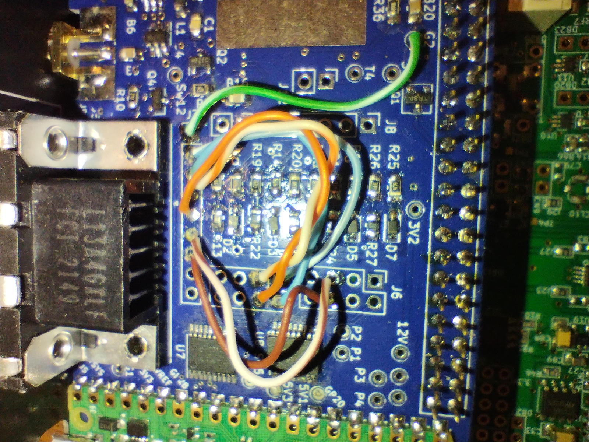

# IO Board K3 Band Data Emulation by G4BRK

This firmware provides binary band data in Elecraft K3 format to the IO Board ACC connector (DB-9).

// Pin details and wiring:
// K3 signal  HL2 GPIO      HL2IO    HL2 ACC
// band0 out  GPIO16_Out1   J4  1    1
// band1 out  GPIO19_Out2   J4  2    2
// band2 out  GPIO20_Out3   J4  3    3
// band3 out  GPIO11_Out4   J4  4    4
// digout0    GPIO10_Out5   J6  5    5
// Keyout-lp  GPIO22_Out6   J6  6    6

## Getting Started

### Wire your IO board signals to the ACC connector

* Solder a jumper from GND      to J7 pin 1.        GND is available at test point G2 or at the SMA connector J9
* Solder a jumper from J4 pin 1 to J7 pin 2.
* Solder a jumper from J4 pin 2 to J7 pin 3.
* Solder a jumper from J4 pin 3 to J7 pin 4.
* Solder a jumper from J4 pin 4 to J7 pin 5.
* Solder a jumper from J6 pin 5 to J7 pin 6.
* Solder a jumper from J6 pin 6 to J7 pin 7.

### Install this firmware
* Power off the HL2 and connect a USB cable to the IO Board.
* Push the button on the Pico and then plug the USB cable into your PC.
* The Pico will appear as a flash drive on the PC. Then download the file [build/main.uf2](build/main.uf2) and copy it to the Pico.
* After the file is copied, the Pico will no longer show up as an external drive.
* Disconnect from the PC and power on the HL2.

For more detail, see the instructions in [Installing Firmware section of the main README](../README.md#installing-firmware).

### Wire up a cable

You need a DB-9 female connector to plug into the ACC socket. This differs from the K3 which needs a DB-15(HD) socket.  
A cable will need to be made up to suit your application.

## Operating 

Band data will be available on the ACC socket according to the TX frequency set in the SDR software.
This can be used to control an amplifier, select antenna by band, etc.

## Code modification

See [Installing Firmware section of the main README](../README.md#installing-firmware).

To debug using printf statements, install minicom, then connect to the pico using the
same USB lead as used for programming.

sudo apt install minicom

minicom -b 115200 -o -D /dev/ttyACM0

your tty port may vary!

## Questions?

Please post questions, issues, etc. to the [Hermes-Lite group](https://groups.google.com/g/hermes-lite).
