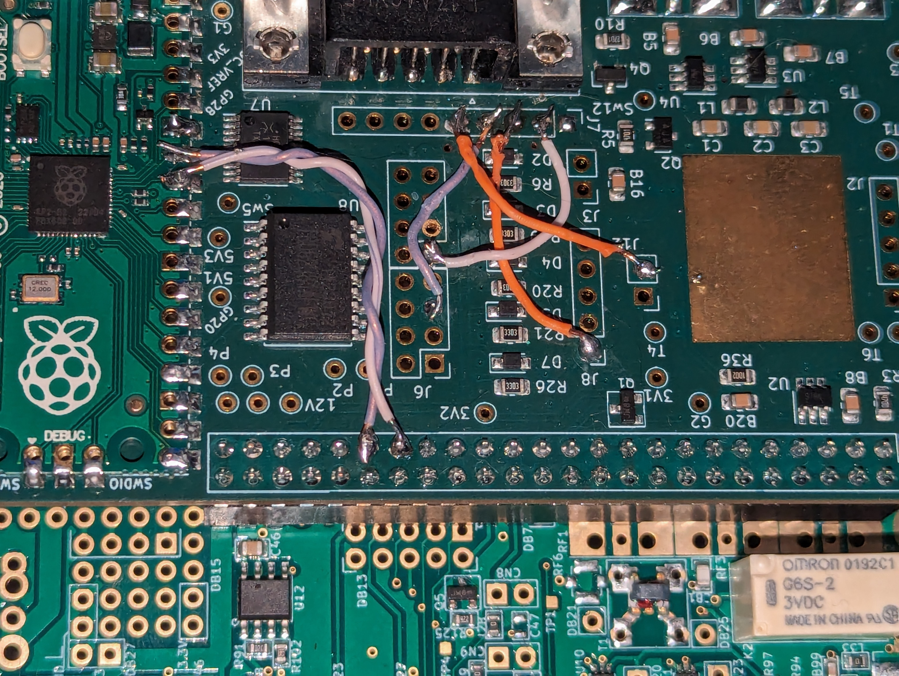

# IO Board Hardrock-50+ Firmware by KS7ROH

This firmware uses the [Hardrock-50+](https://sites.google.com/site/hardrock50beta/hardrock-50-builders-information-site/100w-upgrade-kit) amplifier serial interface to do band changes, facilitate PTT, and to trigger the built-in antenna tuner. The HR-50 serial protocol is described in Chapter 6 of the [Hardrock-50 Manual](https://sites.google.com/site/hardrock50beta/hardrock-50-builders-information-site/instruction-manual). The IO Board antenna tuning protocol is described in the [main README](../README.md#table-of-i2c-registers).

This firmware is based on the work of N1ADJ and N2ADR. 

## Getting Started

### Wire your IO board for serial input/output and PTT

* Solder a jumper from J4 pin 1 to J7 pin 2.
* Solder a jumper from J8 pin 1 to J7 pin 3.
* Solder a jumper from J12 pin 2 to J7 pin 5.
* Solder a jumper from J6 pin 5 to J7 pin 4.

The Hardrock-50 shuts off its serial port while it's in transmit mode, which means there's no way to find out when it's done tuning. initially N1ADJ used a timed transmit approach, but that had to allow for the longest possible tune cycle, so the transmitter stayed on longer than necessay. On the HR-50 mailing list, Patrick AC1KM suggested that it might be possible to use the transmitter's SWR reporting to monitor tuning state and Jim N2ADR suggested wiring that makes that possible. with the following connections, the firmware can monitor forward and reverse power and detect when tuning is complete. The only downside is that there aren't dedicated pads on the board, so you have to solder directly to pins on the 50-pin header and the Pico daughterboard. If you don't feel comfortable doing that, you can omit those connections. Tuning will still work, but the transmitter will stay on for a fixed period rather than shutting off when SWR has stopped changing.

The Hardrock-50+ does not shut off its serial port when transmitting but the above method is still used to gauge the status of the tuner as it is very effective and the programming was already completed by N1ADJ.

### SWR monitoring connections

* Solder a jumper from J1 pin 37 to U1 pin 31.
* Solder a jumper from J1 pin 39 to U1 pin 32.

### Install this firmware
* Power off the HL2 and connect a USB cable to the IO Board.
* Push the button on the Pico and then plug the USB cable into your PC.
* The Pico will appear as a flash drive on the PC. Then download the file [build/main.uf2](build/main.uf2) and copy it to the Pico.
* After the file is copied, the Pico will no longer show up as an external drive.
* Disconnect from the PC and power on the HL2.

For more detail, see the instructions in [Installing Firmware section of the main README](../README.md#installing-firmware).

### Amplifier setup

In the amplifier setup menu, set option `4. Transceiver` to `None` and option `2. ACC Baud Rate` to 19200.

### Wire up a cable

You need a DB-9 male to DB-9 female cable with pins 2, 3, 4 and 5 connected straight through, that is pin 2 to pin 2, pin 3 to pin 3, pin 4 to pin 4, and pin 5 to pin 5.

## Operating

Once the cable is connected between the IO Board and the HR-50+, changing frequencies in SDR software that supports the IO Board should cause the amplifier to change bands. As you switch band in your software, you should see the amplifier change bands as well. It does _not_ trigger the antenna tuner&mdash;you must do that manually if needed.

As far as I'm aware, the only software that implements the antenna tuning protocol is [Reid's HL2-specific Thetis fork](https://github.com/mi0bot/OpenHPSDR-Thetis/releases), starting in version v2.10.3.4-beta1. To trigger automatic tuning, click the `TUNE` button while pressing the `Ctrl` key. (Be sure the `Setup|General|Ant/Filters|Antenna|Disable on Tune Pwr <35W` box is checked, or transmit may stop before tuning is complete.)

## Questions?

Please post questions, issues, etc. to the [Hermes-Lite group](https://groups.google.com/g/hermes-lite).
