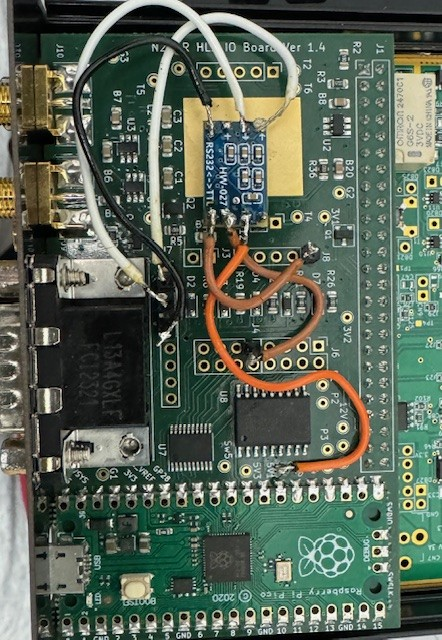
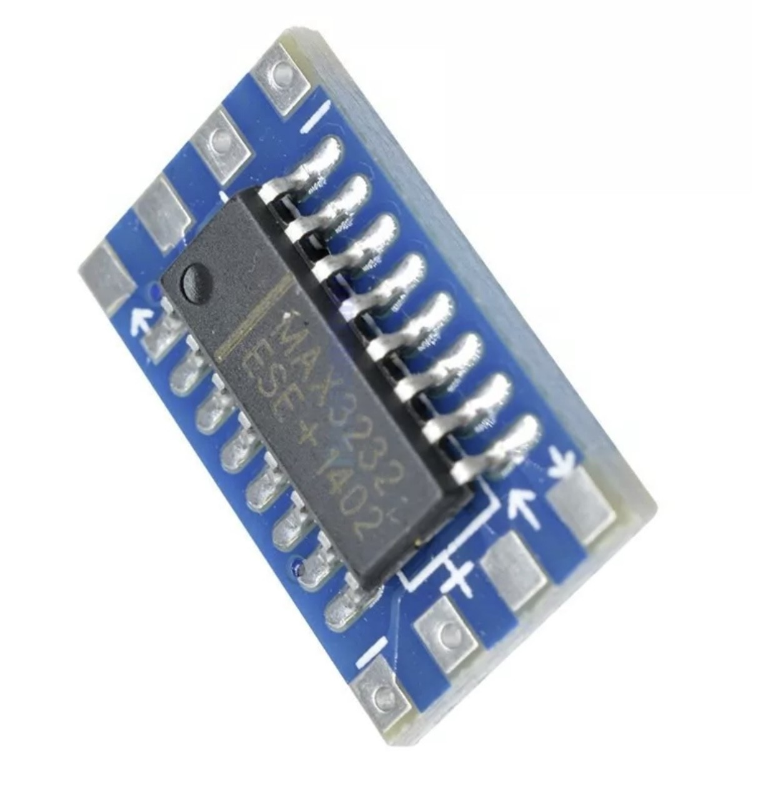
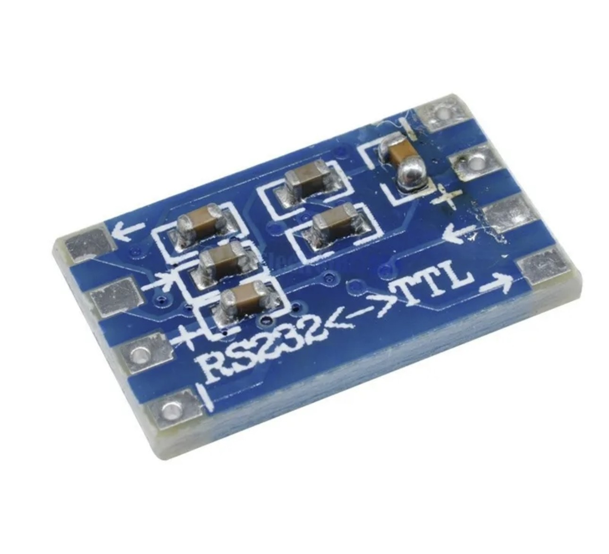

# IO Board SPE Expert Amp Firmware by M0HPF

This firmware uses the [SPE Expert](https://hobbypcb.com/products/hardrock-50-hf-power-amp-kit) amplifier serial interface to do band changes.
The firmware is inspired from the N!ADJ Hardrock-50 firmware.
The firmware requires a small pcb called Hw-027 which contains MAX3232 chip to convert TTL signal to RS232 signal and vice-versa so that the IO board firmware can communicate with SPE Expert Amp directly.

## Getting Started

### Wire your IO board for serial input/output
* Solder a jumper from J4 pin 1 to TTL-IN(i.e <- marked on TTL side of HW-027 board).
* Solder a jumper from J8 pin 1 to TTL-OUT(i.e -> marked on TTL side of HW-027 board).
* Solder a jumper from J12 pin 2 to Negative pin of HW-027 board on either RS232 side or TTL side.
* Solder a jumper from 5V1 of the IO Board to Positive pin of HW-027 board on either RS232 side or TTL side.
* Solder a jumper from RS232-Out(i.e <- marked on RTS232 side of HW-027 board) to J7 pin 2.  
* Solder a jumper from RS232-IN(i.e -> marked on RTS232 side of HW-027 board) to J7 pin 3.
* Solder a jumper from Negative pin of HW-027 board on either RS232 side or TTL side to J7 pin 5.

### Install this firmware
* Power off the HL2 and connect a USB cable to the IO Board.
* Push the button on the Pico and then plug the USB cable into your PC.
* The Pico will appear as a flash drive on the PC. Then download the file [build/main.uf2](build/main.uf2) and copy it to the Pico.
* After the file is copied, the Pico will no longer show up as an external drive.
* Disconnect from the PC and power on the HL2.

For more detail, see the instructions in [Installing Firmware section of the main README](../README.md#installing-firmware).

### Amplifier setup
The SPE amplifier CAT is set to either FLEX or YAESU [FTxxxx 2007+] and Baud rate to 19200.

### Wire up a cable
You need a DB-15 male to DB-9 female cable with tconnection as follows
* DB-15 pin 1 to DB-9 pin 2
* DB-15 pin 9 to DB-9 pin 3
* DB-15 pin 4 to DB-9 pin 5

If you are not building the cable you could use SPE Expert to Yaesu CAT control cable , essentially its the same pin connections mentioned in the manual of SPE Expert for interfacing Yaesu rigs. 

## Operating
Once the cable is hooked between the IO Board and the SPE Expert Amp, changing frequencies in SDR software that supports the IO Board should cause the amplifier to change bands. As you switch band in your software either Thetis or piHPSDR (latest compile from source), you should see the amplifier change bands as well.

## Questions?
Please post questions, issues, etc. to the [Hermes-Lite group](https://groups.google.com/g/hermes-lite).
