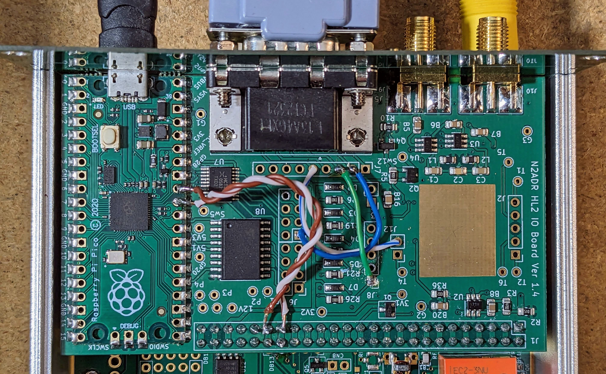

# IO Board Hardrock-50 Firmware by N1ADJ

This firmware implements band changing for the [Hardrock-50](https://hobbypcb.com/products/hardrock-50-hf-power-amp-kit) amplifier. It uses the serial interface described in Chapter 6 of the [Hardrock-50 Manual](https://sites.google.com/site/hardrock50beta/hardrock-50-builders-information-site/instruction-manual). 

## Getting Started

### Wire your IO board for serial output

* Solder a jumper from J4 pin 1 to J7 pin 2.
* Solder a jumper from J13 pin 2 to J7 pin 5.

### Install this firmware
* Power off the HL2 and connect a USB cable to the IO Board.
* Push the button on the Pico and then plug the USB cable into your PC.
* The Pico will appear as a flash drive on the PC. Then copy the file build/main.uf2 to the Pico.
* After the file is copied, the Pico will no longer show up as an external drive.
* Disconnect from the PC and power on the HL2.

For more detail, see the instructions in [the main README Installing Firmware section](../README.md#installing-firmware).

### Amplifier setup

In the amplifier setup menu, set option `4. Transceiver` to `Other` and option `2. ACC Baud Rate` to 19200.

### Wire up a cable

You need a DB-9 male to DB-9 female cable with pins 2 and 5 connected straight through, that is pin 2 to pin 2 and pin 5 to pin 5.

## Operating

Once the cable is hooked between the IO Board and the HR-50, changing frequencies in SDR software that supports the IO Board should cause the amplifier to change bands. As you switch band in your software, you should see the amplifier change bands as well. It does _not_ trigger the antenna tuner&mdash;you must do that manually if needed.

If you tune to a frequency outside of a band the amplifier supports, the HR-50 `BAND:` display will indicate `UNK` and the amplifier will not go into transmit. Because the IO Board doesn't receive the exact transmit frquency, this will not happen exactly at the band edge, but when tuned some distance outside of it. It should not happen when tuned inside the band.

## Questions?

Please post questions, issues, etc. to the [Hermes-Lite group](https://groups.google.com/g/hermes-lite). 
