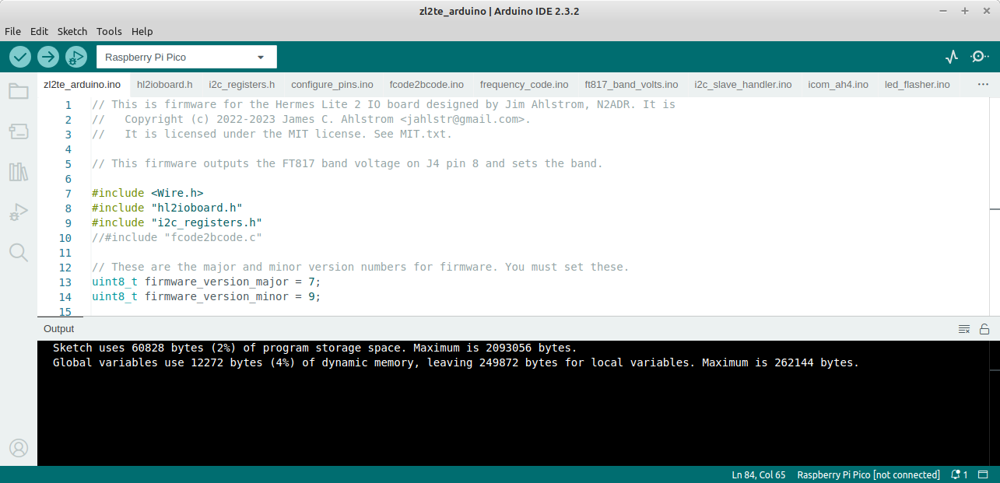

# Arduino code conversion from Pico SDK

This firmware is the modification of the original Pico SDK firmware so that it will compile and install from the Arduino IDE. It is assumed that the user will have the Pico extension to the Arduino environment installed and is familiar with how to compile and upload. If this is not the case, there is plenty of information available on the internet and I recommend that you set it up and become familiar with it before proceeding.

## The General Concept

Apart from the i2c_slave_handler.c there is very little to change in the code. The Arduino IDE adds all the .ino files in the sketchbook directory into a single file and builds that so it is simply a matter of changing the name of the files xxx.c to xxx.ino, commenting out the hl2ioboard.h and i2c_registers.h includes and placing these slightly modified files into the sketchbook folder. Full details follow:

## The firmware example used

This is almostidentical to that used by Jim N2ADR in his n2adr_test example and uses the same libraries. There is a slight difference where Jim only switches 3 filters to show how to do the operation whereas this Arduino example switches five filters.

### The hardware and wiring required

The filter to be switched is a 1 KW capable home brew filter built as an outboard unit with four of its possible six filters installed. Ten metres is covered with an external 10 metre roofing filter in line so the ten metre position is simply a bridge although the future plan is to build the filter into that position. The 160 metre filter is not installed. The relays are activated by grounding the matching pin on the DB_9M plug on the front of the filter. The DB_9M plug connects to the DB_9M plug on the N2ADR IO Board via a DB_9F to DB_9F cable which is broken by inserting a ULN2003 to isolate the Pico IO Board and provide the drive current for the filter switching relays.

The picture below shows the DB9_F to DB9_F lead with the small cast aluminium box containing the ULN2003 and the 12 volt input which is used to power the filter switching relays in the filoter box. At present the I/O lines are connected one to one so each filter switch is driven by one output from J4 on the IO Board but my future plan is to use a 3 of 8 decoder to use 3 IO lines to switch up to 8 filters which will free up enough pins on J7 (the DB9 connector) to allow me to add facilities like RS232 output as well as tuner start and tune complete signals.

### Wiring on the HL2IOBoard

As this board is highly experimantal I did not wish to hard wire the connections as these are expected to be altered several times while I test various scenarios so I elected to solder low profile header sockets into J4 and J7 (the DB9 connector) and joined them with short jumpers cut from the matching pin headers. I am using the 50mm case for my HL2 installation which gives me plenty of room above the HL2 IO Board for clearance of the headers. Shown below is a view of the board showing the header setup.

Using the header pin jumpers:
* jumper from J4 pin 1 to J7 pin 1.
* jumper from J4 pin 2 to J7 pin 2.
* jumper from J4 pin 3 to J7 pin 3.
* jumper from J4 pin 4 to J7 pin 4.
* jumper from J4 pin 5 to J7 pin 5.
* jumper from J4 pin 6 to J7 pin 6.
* Solder a wire from +5V on the Pico board to J7 pin 9. (Not used in this case but done to provide 5 volts to peripherals in future experiments)

## Converting the files:

It is a Quirk of the Arduino IDE that software must be compiled from a folder within the sketchbook directory and that the "maim" code name must be the same as this directory within the sketchbook directory so in this case I have Jim's n2adr_basic/main.c file to my zl2te_arduino directory and renamed it to zl2te_arduino.ino - Note that all .c or .cpp files are renamed to .ino for the Arduino IDE environment.

### Included files:

The CMakeLists.txt files tell the SDK compiler which files to include and also references the library files. The ones used in the n2adr_basic example are ...
* main.c
* hl2ioboard.h
* i2cregisters.h
and from the library:
* configure_pins.c
* led_flasher.c
* i2c_slave_handler.c
* ft817_band_volts.c
* icom_ah4.c
* frequency_code.c
* fcode2bcode.c

In the arduino IDE, rather than having a C Make List file you simply place the files to be used into the sketchbook sub directory that you have created for the project and at compile time they will be picked up by the compiler and compiled as though they were a single file. This means that many #include s will be redundant and are best commented out or deleted and I will go through this file by file as this document proceeds. The final file list in the sketchbook sub directory will be like this ...

* main.c                  becomes	 zl2te_arduino.ino
* hl2ioboard.h            remains	 hl2ioboard.h
* i2cregisters.h          remains	 i2cregisters.h
* configure_pins.c        becomes	 configure_pins.c
* fcode2bcode.c           becomes	 fcode2bcode.c
* frequency_code.c        becomes	 frequency_code.c
* ft817_band_volts.c      becomes	 ft817_band_volts.c
* i2c_slave_handler.c     becomes	 i2c_slave_handler.c
* icom_ah4.c              becomes	 icom_ah4.c
* led_flasher.c           becomes	 led_flasher.c

The picture below shows how this file arrangement will appear in the Arduino IDE

### Changes to the source files
#### 1. zl2te_arduino.ino (was old main.c)
This file has the most extensive changes in function as the Pico SDK I2C functions are completely replaced by the wire library which needs to be included and its callback functions declared but in terms of lines of code it is fairly minimal. It works pretty much the same as the SDK except that the events and their stop procedures are more transparent with the wire library handling all this.
No changes to the functionality of main.c were made in the zl2te_arduino.ino code but some re arranging to accomodate using the wire library and the format that Arduino IDE uses for its layout took place.
For the Arduino IDE the format of the code is like this:
<pre>
#includes and globals

void setup() {
  // put your setup code here, to run once:
}

void loop() {
  // put your main code here, to run repeatedly:
}
</pre>
In the global space wire.h was added
#include <Wire.h>
and a debug was created to monitor the traffic on the I2C port to the HL2 which can be commented out on the final compile. All the debug stuff is enclosed in #ifdef's and is in addition to Jim's main.c code.

All the initialisation code was shifted into the "void setup()" space but is mostly unchanged from the original. stdio is not used as the Arduino IDE has built in print functions etc. and the wire library needs to be invoked along with the function callbacks to deal with the i2c traffic.

The running code that is contained in the "while (1) {	// Wait for something to happen" statement is shifted into the "void loop() {" procedure in the Arduino IDE and is unchanged from the original apart from the fact that I have expanded the "switch (band) {  // Set some GPIO pins according to the band" statement to accomodate 6 bands for my purposes rather than the original 3 bands that Jim used in his example.

#### 2.hl2ioboard.h
Changes were quite minimal here and simply consisted of commenting out 3 lines associated with the Pico SDK i2c handling which has been replaced by the Arduino IDE wire library. I have also declared a 30 character buffer to hold my debug messages which probably shouild have been enclosed in an #ifdef DEBUG_I2C

#### 3. i2c_registers.h
No changes occurred in this file

#### 4. configure_pins.ino
The only changes in this file are for the conversion of Pico SDK i2c initialisation where lines 16 & 17 are changed: 
<pre>
from
    gpio_init(GPIO14_I2C1_SDA);	gpio_set_function(GPIO14_I2C1_SDA, GPIO_FUNC_I2C);
    gpio_init(GPIO15_I2C1_SCL);	gpio_set_function(GPIO15_I2C1_SCL, GPIO_FUNC_I2C);
to
    Wire1.setSDA(GPIO14_I2C1_SDA);
    Wire1.setSCL(GPIO15_I2C1_SCL);
and lines 18 & 19 are commented out
    // i2c_init(i2c1, I2C1_BAUDRATE);
    // i2c_slave_init(i2c1, I2C1_ADDRESS, &i2c_slave_handler);
</pre>
#### 5. fcode2bcode.ino
Simply commenting out the redundant #include "hl2ioboard.h" in line 8 is all that is required here.

#### 6. frequency_code.ino
No changes to this file at all.

#### 7. ft817_band_volts.ino
Commenting out #include "hl2ioboard.h" and #include "i2c_registers.h" in lines 8 & 9 is all that is required on this file.

#### 8. i2c_slave_handler.ino
This file is the most complex as it receives the i2c signals and processes them. The original SDK code used the raw data from i2c interrupts which are hidden in the wire library and requires some code changes.

The first signal sent in from the i2c master (the HL2) to the slave (IO Board) is an event to describe what kind of event it is which is processed in a switch ... case statement as in this psuedo code ...
<pre>
switch (event) {
    case I2C_SLAVE_RECEIVE: // master has written data and this slave receives it
        Process this data;
    case I2C_SLAVE_REQUEST: // master is requesting data
        Process this data;
    case I2C_SLAVE_FINISH: // master has signalled Stop or Restart
        Stop the I2C_SLAVE_RECEIVE or I2C_SLAVE_REQUEST procedure
</pre>
The above code is handled by callback functions declared in zl2te_arduino.ino as "receiveEvent" and "requestEvent" and these replace I2C_SLAVE_RECEIVE and I2C_SLAVE_REQUEST respectively. There is no need to handle I2C_SLAVE_FINISH as this is built into the wire library.

The code inside the "receiveEvent" callback function handles the incoming data from the HL2 i2c master a little differently from the I2C_SLAVE_RECEIVE which handles each incoming byte one by one whereas the wire library keeps reading data in a stream until the (hidden) stop is sent. This requires a buffer to hold the stream which is declared as "uint8_t inward[6];". The first character received into the buffer will be the Control Register and subsequent bytes, the data to be processed referred to the control register. The HL2 master will only send either one or two bytes with the first byte being the control register and if there is a second byte, the data. In the case of a single byte, the control register is being nominated for a "requestEvent" and the callback can be terminated at that point. The receiveEvent also receives a byte count of the bytes being sent from the master and this can be used to discriminate between a receiveEvent requiring further processing and setting a the control register for a requestEvent. The "inward[6]" buffer really only needs to be 3 bytes long but when experimenting initially I made the buffer bigger in case the HL2 was sending control register plus 4 data bytes which is not the case but I left the buffer size at 6 as memory is not an issue with the Pico.

In addition in the early stages I was debugging and created a buffer to hold the string sent from the HL2 and display it as the callback and the data received formatted as a decimal number. I have put all these in a #ifdef DEBUG_I2C to remove them on final compile by commenting out the line "#define DEBUG_I2C" in zl2te_arduino.ino in order to skip all this. You can remove all these statements from the code if you do not wish to have the debug facility available.

The callbacks process the commands from the HL2 in exactly the same manner as Jim does in his n2adr_basic software and there are no changes to the code around this.

#### 9. icom_ah4.ino
Commenting out #include "hl2ioboard.h" and #include "i2c_registers.h" in lines 13 & 14 is all that is required on this file.

#### 10. led_flasher.ino
Commenting out #include "hl2ioboard.h" on line 7 is the only change required on this file.

### Installing the firmware
The firmware needs to be compiled for a Raspberry Pi Pico in the Arduino IDE which means that the files used need to be in your sketchbook directory. The easiest way to achieve this is to clone the repository (git clone https://github.com/jimahlstrom/HL2IOBoard.git) into a suitable directory - maybe a "Programs" directory and copy the directory "zl2te_arduino" into your sketchbook. There is no need to stay with the name zl2te_arduino but if you change it then you need to rename the zl2te_arduino.ino to the same name as the parent directory. 
If you are a linux user, make sure that you are a member of the dialout and tty groups.

* Power off the HL2 and connect a USB cable to the IO Board.
* Plug the USB cable into your PC.
* The Pico will appear as a USB connection on the Arduino which needs to be selected as the port.
* Compile the code and check for errors and if clean upload. It should automatically make the Pico will appear as a flash drive and upload the code but in some cases you may need to unplug the USB cable, push the button on the Pico and plug the
  cable back in.
* Disconnect from the PC and power on the HL2.

#### This is what a good compile looke like.

### Post installation testing
Check that when switching bands the correct voltage occurs on the associated pin on J4. Yo can see from the code in the zl2te_arduino.ino file which pin belongs to which band. The same test can be applied to the band voltage on J4 pin 8. This will prove that everything is working and you can customize from there.

## Looking ahead
It is unlikely that the basic environment is what you will be looking for in your final installation but this at least is a foundation to build your code on. In my case I will be writing code to talk to my antenna tuner which at present has a single input line to prime it to start tuning on the arrival or more than 1 watt signal and when it has stopped tuning I stop the spot button. Very manual, so using the potential of the IO board I may send serial commands like frequency in use and receive back responses including the L and C used and tune finished. The potential is big here and I am looking at monitoring for my linear and perhaps sending data to an external application for remote access as I run my HL2 on remote mode all the time even on my home QTH

## Questions?

Please post questions, issues, etc. to the [Hermes-Lite group](https://groups.google.com/g/hermes-lite).
